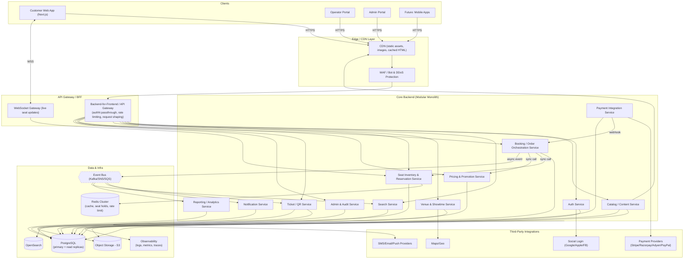
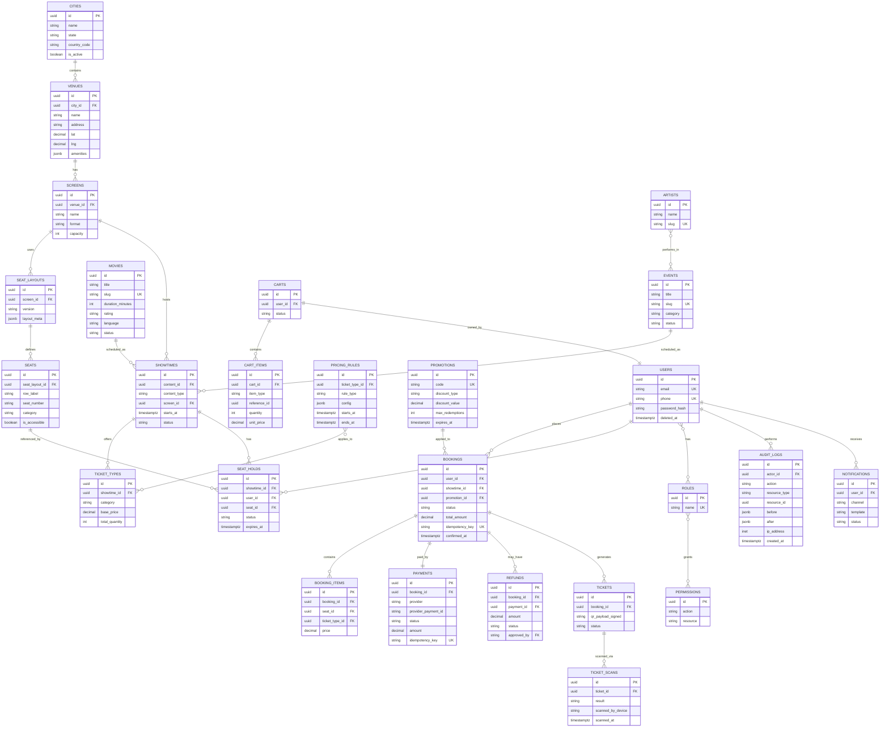

# ShowNest — End-to-End Ticketing Platform Blueprint

*A production-grade architecture and implementation blueprint for a movies/events/sports ticket-booking platform.*

> Note: No sketch image was actually attached to this conversation — only the text brief came through. This blueprint follows the described customer journey (login → city → browse → details → seat selection → checkout → confirmation → admin) and extends it with original product decisions, as invited by the brief.

---

## 1. Executive Summary

ShowNest is built as a **modular monolith backend** fronted by a **Next.js (App Router, TypeScript) web client**, with three separate frontend surfaces — customer web app, venue/operator portal, and super-admin portal — sharing a common component library and API contract layer.

**Core technology choices:**

| Layer | Choice | Why |
|---|---|---|
| Frontend | Next.js 14+ (App Router), TypeScript, Tailwind, TanStack Query, Zustand, RHF+Zod | RSC for fast SEO'd content pages, client islands for interactive seat maps, strong typing end-to-end |
| Backend | Modular monolith (Node.js/NestJS or equivalent), domain-driven modules | Ship fast with one deployable, but module boundaries are service-shaped from day one so hot paths (seat inventory, search) can be extracted without a rewrite |
| Primary DB | PostgreSQL | ACID transactions are non-negotiable for seat locking and payments; mature partitioning, row-level locking, `SELECT … FOR UPDATE SKIP LOCKED` |
| Cache / coordination | Redis (Cluster) | Sub-millisecond seat-hold locks, TTL-based holds, pub/sub for live seat updates, rate limiting |
| Search | OpenSearch/Elasticsearch | Faceted search across movies/events/venues/artists/cities |
| Queue/Event bus | Kafka (or SQS/SNS at smaller scale) | Decouple booking confirmation, notifications, ticket generation, analytics from the request path |
| Object storage | S3-compatible | Posters, banners, generated tickets/QRs, seat-layout SVGs |
| Payments | Provider-agnostic abstraction over Stripe/Razorpay/Adyen/PayPal | Geography-specific rails (UPI, cards, wallets) without coupling business logic to one vendor |
| Realtime | WebSockets (fallback SSE) | Live seat-map state without polling storms during blockbuster releases |

**Why this scales safely for high-demand releases (e.g., a blockbuster's midnight show going on sale):**

1. **Seat inventory is isolated from the rest of the monolith** behind its own API and backed by Redis atomic operations + Postgres row locks, so a spike in seat-hold traffic cannot starve login, search, or browse traffic.
2. **Read-heavy catalog/browse traffic is served from CDN + cache + read replicas**, never hitting the primary write path.
3. **Write traffic for "hold seat" is idempotent and short-lived (TTL-based)**, so failed/abandoned attempts self-heal without manual cleanup.
4. **A virtual waiting-room/queue sits in front of checkout** for known high-demand on-sales, smoothing burst traffic into a steady admission rate the seat-inventory service can sustain.
5. **Everything that isn't on the critical path of "confirm my seat" is asynchronous** — notifications, analytics, recommendations, loyalty points — via the event bus, so payment confirmation latency is not coupled to email/SMS provider latency.
6. **The modular monolith is deliberately not microservices on day one.** Splitting seat-inventory and payments out first (once traffic justifies it) is the intended evolution path, not a rewrite.

---

## 2. System Architecture Diagram



**Legend:** Solid arrows = synchronous request/response (REST/gRPC). Dashed node (`QUEUE`) = asynchronous, event-driven flows (booking confirmed → notify, generate ticket, update analytics, refresh search index). The `BOOKING` service is the only module allowed to call `SEAT`, `PRICING`, and `PAYMENT` synchronously in the critical checkout path; everything downstream of a confirmed booking is event-driven so a slow email provider never blocks a payment confirmation response to the user.

---

## 3. User Roles and Permissions

| Role | Allowed Actions | Protected Resources | Approval Required | Audit Logging |
|---|---|---|---|---|
| **Guest** | Browse catalog, search, view details, view seat map (read-only), start guest checkout | None | N/A | Session events only |
| **Registered Customer** | All guest actions + book, pay, cancel/reschedule own bookings, save preferences, manage profile, apply promo/loyalty, write reviews | Own bookings, own profile, own payment methods | N/A | All booking/payment actions logged |
| **Venue Operator** | Manage own venue(s): screens/seat layouts, showtimes, seat blocking, view own bookings/reports | Own venue's data only (row-level scoping by `venue_id`) | Seat-layout changes affecting sold tickets require Support/Admin sign-off | Full CRUD audit trail |
| **Event Organizer** | Create/manage own events, set base pricing tiers, view sales dashboards for own events | Own events only | Publishing an event to "live" requires Content Manager approval | Full CRUD audit trail |
| **Support Agent** | View any booking, issue refunds up to configured limit, resend tickets, unlock accounts, view (not edit) payment records | Read access to customer PII (masked by default, reveal logged) | Refunds above threshold escalate to Finance Manager | Every PII view + refund logged with reason code |
| **Finance Manager** | Approve high-value refunds, view reconciliation reports, manage payout configuration, view chargebacks | Payment/settlement data | Payout config changes require dual sign-off (Finance + Super Admin) | All financial mutations logged, immutable |
| **Content Manager** | Approve/publish movies/events, manage artists, categories, banners, SEO metadata | Catalog write access | New venue partner onboarding requires Super Admin | Publish/unpublish actions logged |
| **Super Admin** | Full system access: roles, feature flags, global config, all data | Everything | Self-approval disabled for role-grant actions above "Support Agent" (requires second Super Admin) | Every mutation logged; role grants specifically flagged for review |
| **Gate/Check-in Staff** | Scan/validate tickets for assigned venue+event only, mark entry, view live attendance count | Ticket-validation endpoint scoped to assigned showtime(s) | N/A | Every scan (success/duplicate/invalid) logged with device id + timestamp |

**Cross-cutting rules:**
- RBAC is enforced server-side on every endpoint; the frontend hides UI but never gates access.
- Row-level scoping (venue_id, organizer_id) is enforced at the query layer, not just the controller layer, to prevent IDOR.
- All admin/operator/support actions write to an **append-only `audit_logs` table** (see §9) with actor, action, resource, before/after diff, IP, and timestamp.
- Step-up MFA is required for Finance Manager and Super Admin sessions, and re-prompted for high-risk actions (refund approval, role grant, payout config change).

---

## 4. Information Architecture and Sitemap

### 4.1 Public Website (unauthenticated + authenticated customer)

```
/                                  → Home (city-aware)
/cities                            → City selector (also a modal on first visit)
/movies                            → Movies category listing
/movies/[citySlug]/[movieSlug]     → Movie details
/events                            → Events listing (concerts, comedy, theatre)
/events/[citySlug]/[eventSlug]     → Event details
/sports                            → Sports listing
/sports/[citySlug]/[eventSlug]     → Sports event details
/venues/[venueSlug]                → Venue profile page
/search?q=...&type=...             → Search results
/artists/[artistSlug]              → Artist profile (their shows across cities)
/booking/[showtimeId]/seats        → Seat selection (route guard: requires active hold session)
/booking/[showtimeId]/addons       → Add-ons
/booking/[showtimeId]/review       → Booking review
/booking/[showtimeId]/payment      → Payment (route guard: requires reviewed cart)
/booking/confirmation/[bookingId]  → Confirmation
```

### 4.2 Authentication Flows

```
/auth/login
/auth/register
/auth/forgot-password
/auth/reset-password/[token]
/auth/verify-email/[token]
/auth/social/callback/[provider]
```
Route guard: any `/auth/*` page redirects to `/` if a valid session already exists.

### 4.3 Customer Account Area (guard: requires session)

```
/account                           → Overview
/account/bookings                  → My bookings (upcoming/past)
/account/bookings/[bookingId]      → Booking + ticket/QR detail
/account/bookings/[bookingId]/cancel
/account/bookings/[bookingId]/reschedule
/account/profile
/account/payment-methods
/account/loyalty
/account/gift-cards
/account/notifications-settings
/account/price-alerts
/account/waitlists
```

### 4.4 Admin Portal (guard: requires role ∈ {ContentManager, FinanceManager, SuperAdmin, SupportAgent})

```
/admin/login                        → separate, MFA-enforced login
/admin/dashboard
/admin/catalog/movies
/admin/catalog/events
/admin/catalog/artists
/admin/venues
/admin/venues/[venueId]/screens
/admin/venues/[venueId]/screens/[screenId]/layout   → seat-layout builder
/admin/showtimes
/admin/pricing-rules
/admin/promotions
/admin/bookings
/admin/bookings/[bookingId]
/admin/refunds
/admin/refunds/[refundId]/approve   → guard: FinanceManager | SuperAdmin
/admin/users
/admin/roles                        → guard: SuperAdmin only
/admin/audit-logs                   → guard: SuperAdmin only
/admin/reports
/admin/feature-flags                → guard: SuperAdmin only
```

### 4.5 Venue/Operator Portal (guard: role=VenueOperator, scoped to `venue_id` claims)

```
/operator/login
/operator/dashboard
/operator/screens
/operator/showtimes
/operator/seat-blocking
/operator/bookings                  → read-only, own venue
/operator/reports
/operator/gate                      → check-in scanner (also usable by GateStaff role)
```

### 4.6 Support Portal (guard: role=SupportAgent | FinanceManager | SuperAdmin)

```
/support/search-booking
/support/bookings/[bookingId]
/support/refund-request/[bookingId]
/support/account-unlock
/support/ticket-resend
```

**Route guard implementation:** Next.js middleware reads the session JWT, checks `role` and, for operator scoping, `venue_ids` claim; unauthorized requests are redirected to the relevant `/*/login` with a `?next=` param preserved. Every guarded route is *also* re-checked server-side at the API layer — the middleware is a UX convenience, not the security boundary.

---

## 5. Frontend Architecture

**Stack:** Next.js 14+ (App Router) + TypeScript, Tailwind CSS + a small design-token layer, TanStack Query for server state, Zustand for genuinely client-only state (seat-hold countdown timer, seat-map selection, checkout wizard step), React Hook Form + Zod for all forms, native WebSocket client (with SSE fallback) for seat-map liveness, Playwright for E2E, Vitest + Testing Library for unit/component, Storybook for the shared UI library.

### 5.1 Why RSC + client islands
Content pages (movie/event details, category listings, venue pages) are **React Server Components** — rendered on the server, cacheable, great for SEO and first paint. The **seat map, countdown timer, and checkout wizard are client components** — they need WebSocket connections and frequent local state updates that don't belong on the server.

### 5.2 Folder structure

```
apps/
  web/                        # customer web app
    app/
      (marketing)/
        page.tsx                       # home
        cities/page.tsx
      movies/[city]/[slug]/page.tsx
      events/[city]/[slug]/page.tsx
      sports/[city]/[slug]/page.tsx
      search/page.tsx
      booking/
        [showtimeId]/
          seats/page.tsx
          addons/page.tsx
          review/page.tsx
          payment/page.tsx
        confirmation/[bookingId]/page.tsx
      account/
        layout.tsx
        bookings/page.tsx
        bookings/[id]/page.tsx
      auth/
        login/page.tsx
        register/page.tsx
      api/                              # BFF route handlers (thin proxies + cookie handling)
      layout.tsx
      middleware.ts
    features/
      seat-map/
        components/SeatMap.tsx
        components/SeatLegend.tsx
        hooks/useSeatSocket.ts
        store/seatSelectionStore.ts     # Zustand
      checkout/
        components/AddonsStep.tsx
        components/PromoInput.tsx
        hooks/useCheckoutQuery.ts
      catalog/
      search/
      auth/
    shared/
      ui/                               # thin re-export of packages/ui
      lib/
        api-client.ts
        analytics.ts
      hooks/
    tests/
      e2e/
      unit/
  admin/                       # admin portal (same structural pattern)
  operator/                    # operator portal (same structural pattern)

packages/
  ui/                          # shared design system (Button, SeatCell, Modal, DataTable...)
  config/                      # eslint, tailwind, tsconfig presets
  types/                       # shared TS types / zod schemas mirroring API contracts
  analytics/                   # event taxonomy + typed track() wrapper
```

### 5.3 Component hierarchy (seat-map feature, as the deepest example)

```
<SeatSelectionPage>
  <ShowtimeSummaryBar />
  <HoldCountdownBanner />          # client, ticks down from Zustand store
  <SeatMap>                        # client, subscribes to WS
    <ScreenIndicator />
    <SeatGrid>
      <SeatRow>
        <SeatCell status="AVAILABLE|HELD|SOLD|SELECTED|BLOCKED" />
      </SeatRow>
    </SeatGrid>
    <SeatLegend />
    <AccessibilityFilterToggle />
  </SeatMap>
  <SelectionSummarySidebar />
  <ContinueButton />
</SeatSelectionPage>
```

### 5.4 Design tokens

ShowNest has adopted a finished design system — **"Editorial Premiere"** — as the canonical visual language for the customer web app, superseding the placeholder dark "cinema marquee" direction floated earlier in this blueprint. It replaces the typical dark, neon entertainment-app look with a bright, high-trust, magazine-editorial aesthetic: heavy whitespace, restrained shadows, a single vivid accent color, and content-first layout. Tokens are defined once in `packages/ui/tokens.ts` (source of truth) and consumed both by the Tailwind config's `theme.extend` (via a generated `tailwind.config` block, exactly as prototyped in the reference `code.html`) and as CSS custom properties for any non-Tailwind styling needs.

**Color (Material-3-shaped token set, mapped to Tailwind color keys):**

| Token | Value | Usage |
|---|---|---|
| `primary` | `#ba0036` (Vivid Coral-Red) | Primary CTAs, active/selected states, essential nav highlights — used sparingly, reserved for "the energy of the system" |
| `on-primary` | `#ffffff` | Text/icons on primary-filled surfaces |
| `primary-container` | `#e21e4a` | Secondary emphasis fills (e.g. hover/pressed variants, promo banners) |
| `secondary` | `#5f5e5e` | Secondary text, borders on secondary buttons |
| `tertiary` | `#5c5c5c` | Metadata, labels, icons that shouldn't compete with primary content |
| `background` | `#fff8f7` | Page background (soft warm-white, not stark white) |
| `surface` | `#fff8f7` | Base surface |
| `surface-container-lowest` | `#ffffff` | Cards and primary content containers (pure white, the "Z-1" plane) |
| `surface-container` / `-high` / `-highest` | `#ffe9e9` / `#ffe1e2` / `#fbdbdc` | Tiered tonal layers for nested sections, footer, tag backgrounds |
| `on-surface` | `#281718` | Primary text (dark charcoal-red, not pure black) |
| `on-surface-variant` | `#5c3f41` | Secondary/muted text |
| `outline` / `outline-variant` | `#906f70` / `#e5bdbe` | Borders — 1px hairlines instead of shadows to define card boundaries |
| `error` / `on-error` / `error-container` | `#ba1a1a` / `#ffffff` / `#ffdad6` | Form/system error states |

Full token set (40+ roles incl. `inverse-*` and `*-fixed` variants for future dark-mode support) lives in `DESIGN.md` at the repo root and is treated as the design-to-code contract — any new component's color usage is reviewed against these named roles, never an ad-hoc hex value.

**Typography:** Single family, **Hanken Grotesk** (400–800), across every level — display, headline, body, and label — for a sharp, contemporary, tech-forward feel with generous x-height. Scale: `display-lg` 48px/56px/700 (page heroes) → `headline-lg` 32px/40px/700 (section titles, 24px/32px on mobile) → `headline-md` 24px/32px/600 (card/subsection titles) → `body-lg` 18px/28px/400 and `body-md` 16px/24px/400 (content) → `label-md` 14px/20px/600 with `0.05em` uppercase tracking and `label-sm` 12px/16px/500 (functional UI: chips, timestamps, form labels). Negative letter-spacing on display/headline levels (`-0.01em` to `-0.02em`) keeps large type compact and editorial; label levels use *positive* tracking to visually separate functional UI text from narrative content.

**Spacing:** 4px base unit. Desktop container max-width 1280px with 40px page margins and a 12-column grid at 24px gutters; mobile uses a 4-column grid, 16px gutters, 20px margins. Named stack tokens (`stack-sm` 8px, `stack-md` 16px, `stack-lg` 32px) drive component-internal rhythm; section-to-section vertical rhythm is deliberately large (64–80px) to read like magazine-spread breaks, distinct from tighter in-component spacing.

**Shape:** `rounded` scale from `sm` (4px, chips' inner elements) through `DEFAULT`/`md` (8–12px, buttons/inputs/small components) to `lg`/`xl` (16–24px, movie posters, event cards, featured banners) to `full` (pill-shaped chips and category filters). Large imagery gets the softest radius to offset high visual impact; structural containers stay closer to 12px.

**Elevation:** No heavy drop shadows anywhere in the primary content flow — depth comes from **tonal layering** (`surface` → `surface-container-*` steps) and 1px `outline-variant` hairlines. The one `editorial-shadow` utility (20–40px blur, 4–6% opacity, charcoal-tinted) is reserved exclusively for floating elements — modals, dropdowns, the seat-map's sticky mobile summary sheet — so it reads as "this is temporarily above the page," never as generic card decoration.

**Dark mode:** Deferred. The system ships `html.light` only for MVP (as prototyped) since the entire brand thesis is "bright, not neon-dark" — the `*-fixed`/`inverse-*` token roles are already present in `DESIGN.md` for a future dark variant, but building it isn't on the Phase 1 critical path.

### 5.5 Feature module boundaries
Each `features/*` folder owns its components, hooks, and Zustand store; it may import from `shared/` and `packages/*` but **never from another feature module directly** — cross-feature communication happens through URL state, TanStack Query cache, or the API. This keeps `seat-map` extractable later without unwinding cross-imports.

### 5.6 Error / loading / empty states
Every data-fetching boundary has three co-located components: `*.loading.tsx` (skeletons, not spinners, to reduce layout shift), `*.error.tsx` (uses Next's `error.tsx` convention, reports to Sentry, offers retry), `*.empty.tsx` (contextual — e.g., "No shows in your city yet" with a city-switch CTA, not a generic "no results").

### 5.7 Accessibility
WCAG 2.1 AA minimum. Seat map is keyboard-navigable (arrow keys move focus between seats, Enter/Space selects, screen-reader announces seat id + price + status on focus). Color is never the only signal for seat status (icons/patterns too). All forms have associated `<label>`, inline error text linked via `aria-describedby`. Focus is trapped correctly in modals (promo code, add-ons). Minimum tap target 44×44px on mobile.

### 5.8 Mobile-first responsiveness
Build at 360px width first. Seat map uses pinch-zoom/pan (not squeezed grids) below 480px width, with a sticky bottom sheet for selection summary instead of a sidebar. Checkout collapses to a single-column linear wizard on mobile vs. a two-column summary+form layout on desktop.

### 5.9 SEO strategy (public content pages)
- Movie/event/venue pages are RSC, statically generated where possible with ISR (revalidate on catalog update event from the queue).
- Structured data: `Event`, `Movie`, `Offer` JSON-LD schema on every showtime-bearing page for rich snippets (dates, prices, availability).
- Canonical URLs per city+slug; `hreflang` for localized variants.
- Dynamic OG images generated at build/ISR time for social shares.
- Sitemap.xml generated incrementally from the catalog service, submitted via a scheduled job.

### 5.10 Image optimization
`next/image` with a custom loader pointing at the CDN's image-resizing edge function; posters/banners stored once in S3 at max resolution, resized on the fly with aggressive edge caching. AVIF/WebP with JPEG fallback. LQIP blur placeholders generated at upload time and stored alongside metadata.

### 5.11 Internationalization and localization
`next-intl` (or equivalent) with locale segments (`/en-IN/...`, `/hi-IN/...`). Currency and date formatting via `Intl` APIs, city-aware currency (multi-country expansion path). Translated content (movie synopsis, event descriptions) stored per-locale in the catalog DB, not machine-translated at render time. RTL support built into the design tokens (logical CSS properties, not `left/right`).

### 5.12 Performance budgets
- LCP < 2.0s (p75) on 4G for content pages, < 2.5s for seat-map page (network + WS connect).
- JS bundle: < 150KB gzipped route-level for content pages; seat-map feature bundle < 220KB (code-split, lazy-loaded).
- CLS < 0.1 — enforced by reserving image/skeleton dimensions.
- Enforced in CI via Lighthouse CI budgets that fail the build on regression.

### 5.13 Caching strategy
- CDN edge cache for static/ISR pages (TTL minutes, tag-invalidated on catalog publish events).
- TanStack Query: `staleTime` tuned per resource — catalog data (5 min), seat map (0, always live via WS + short poll fallback), user profile (session-scoped).
- Service worker caches the shell + last-viewed ticket QR for **offline ticket wallet** access (see §6 innovations).

### 5.14 Analytics event naming convention
`snake_case`, `<domain>_<object>_<action>` — e.g. `catalog_movie_viewed`, `booking_seat_selected`, `booking_promo_applied`, `checkout_payment_submitted`, `checkout_payment_succeeded`. All events carry a common envelope: `user_id | anonymous_id, session_id, city, platform, timestamp`. A typed `track()` wrapper in `packages/analytics` prevents ad-hoc event names from ever reaching the pipeline.

### 5.15 Feature flags and A/B testing
A lightweight flag service (e.g., Unleash/self-hosted or a managed provider) evaluated server-side in the BFF layer for pages, and client-side via a typed hook for micro-interactions (e.g., testing seat-map zoom-to-select vs. tap-to-select). Flags are scoped by city/role/percentage rollout; every flag has an owner and a kill-switch default of "off."

### 5.16 Example frontend folder tree (condensed)

```
apps/web
├── app
│   ├── (marketing)/page.tsx
│   ├── movies/[city]/[slug]/page.tsx
│   ├── booking/[showtimeId]/seats/page.tsx
│   ├── booking/[showtimeId]/payment/page.tsx
│   ├── account/bookings/[id]/page.tsx
│   └── middleware.ts
├── features/seat-map/{components,hooks,store}
├── features/checkout/{components,hooks}
├── shared/{ui,lib,hooks}
└── tests/{unit,e2e}
packages/ui/{Button,SeatCell,Modal,DataTable}.tsx
packages/types/api-contracts.ts
```

---

## 6. UI/UX Page-by-Page Blueprint

> Visual style direction: **"Editorial Premiere"** — a bright, Corporate/Modern design system with strong minimalist influence, moving deliberately away from the dark neon-entertainment cliché toward a high-trust, high-end-lifestyle-magazine feel. Warm-white surfaces (`#fff8f7`/`#ffffff`), a single vivid Coral-Red accent (`#ba0036`) reserved strictly for primary CTAs and active/selected states, dark-charcoal text (`#281718`) for readability, generous whitespace and 64–80px section rhythm, hairline `1px` borders instead of shadows for card boundaries, and diffused low-opacity shadows reserved only for floating elements (modals, dropdowns). Typography is Hanken Grotesk throughout, with heavy weight contrast (700/600 display and headline vs. open 400 body) driving hierarchy instead of color variety. Full token spec: `packages/ui/tokens.ts` / `DESIGN.md` (§5.4). A reference homepage implementation already exists (`code.html`) and is the canonical pattern every page below should visually match — same header treatment, card shadow/radius conventions, button styles, and spacing scale.

**Core reusable components (from the adopted system, used throughout the pages below):**
- **Buttons:** Primary = coral-red fill, white text, 12px radius, no shadow, darkens 10% on hover. Secondary = white fill, 1px charcoal border, charcoal text. Tertiary = text-only link in the primary color, semi-bold weight.
- **Cards (movies/events):** 2:3 poster aspect ratio for movies, 16px image radius, metadata (title/genre/rating) below the image with strict 8px vertical rhythm — this is the pattern used in the Home page's "Recommended Movies" rail and repeats across every listing/discovery page.
- **Inputs:** 1px gray border, 12px radius, white fill; focus state swaps the border to charcoal and adds a low-opacity 2px coral "ring" — used identically across search, forms, and checkout fields.
- **Chips/filters:** Pill-shaped, light-gray fill/gray text at rest; coral fill/white text when active — used for genre/language/date filters and category tags.
- **Seat map:** Selected seats render in the primary coral (the single most vibrant element on the seat-map screen, by design); unavailable seats render in a soft light gray. This directly informs the seat-status color system in §8.1 and §9 — `SELECTED` maps to `primary`, `SOLD`/`BLOCKED`/`UNAVAILABLE` map to a desaturated gray-family token, keeping the "one vibrant color = the user's choice" principle intact even under the seat-inventory state machine's five-plus statuses.

### 6.1 Home Page
- **Purpose:** City-aware discovery entry point.
- **Primary actions:** Change city, browse hero carousel, jump into a category, search.
- **Sections:** Sticky header (logo, city pill, search bar, account menu) → Hero carousel (top releases/events) → "Now Showing" movie rail → "Live Events near you" rail → "Sports" rail → "Recommended for you" (personalized) → City-specific promotions banner → Footer.
- **Desktop:** Multi-rail horizontal-scroll layout, 4–6 cards visible.
- **Mobile:** Single-column stacked rails, horizontal scroll per rail, sticky bottom nav (Home/Search/Bookings/Account).
- **Interactions:** Rail cards show a quick-peek (rating, genre, next showtime) on hover (desktop) / tap-and-hold (mobile).
- **Empty/loading/error:** Skeleton rails while loading; if a city has no content, show curated "trending nationally" fallback with a clear "Nothing live in Chennai yet — here's what's trending" message rather than a blank page.
- **Accessibility:** Carousel is keyboard-navigable with visible focus rings; auto-rotating hero pauses on focus/hover and has a pause control.
- **Innovation:** "Friends are watching" strip (opt-in) showing which connections have booked upcoming shows.

### 6.2 City Selector
- **Purpose:** Set/confirm the active city, which scopes all subsequent catalog queries.
- **Primary actions:** Auto-detect via geolocation (with explicit permission prompt), search city, pick from popular cities grid.
- **Desktop:** Modal centered over a dimmed home page.
- **Mobile:** Full-screen sheet.
- **Interactions:** Typeahead search with fuzzy match; "Use my location" button triggers geolocation → reverse-geocode → nearest supported city.
- **Empty/error:** If geolocation denied or city unsupported, show manual picker with a "Notify me when ShowNest launches in [city]" capture.
- **Accessibility:** Focus trapped in modal/sheet; Escape closes.

### 6.3 Login / Register
- **Purpose:** Authenticate or create an account; support guest checkout decision.
- **Primary actions:** Email/password login, social login (Google/Apple), register, forgot password, "continue as guest."
- **Sections:** Tabbed Login/Register card, social buttons above the divider, guest checkout link below.
- **Desktop:** Centered card, ~440px wide, marketing image alongside on wide screens.
- **Mobile:** Full-width form.
- **Interactions:** Real-time Zod validation (email format, password strength meter), inline error text, magic-link option for passwordless.
- **Empty/error:** Clear distinction between "invalid credentials" vs "account not found" vs "too many attempts, try again in Xs" (rate-limited).
- **Accessibility:** Password visibility toggle has an accessible label; strength meter has a text equivalent, not color-only.
- **Innovation:** Guest checkout explicitly offered at the point of booking (not forced registration), with a post-purchase prompt to claim the booking into a new account via the confirmation email.

### 6.4 Search Results
- **Purpose:** Cross-entity search (movies, events, venues, artists, cities).
- **Primary actions:** Refine query, apply filters, switch result-type tabs.
- **Sections:** Search bar (persistent), type tabs (All/Movies/Events/Sports/Venues/Artists), filter sidebar (desktop) / filter sheet (mobile), result grid, pagination/infinite scroll.
- **Desktop:** Left filter rail (language, genre, date, price, venue, distance, accessibility, availability) + right result grid.
- **Mobile:** Filters behind a "Filters" button opening a bottom sheet with an "Apply" CTA showing live result count.
- **Interactions:** Debounced query-as-you-type with suggestion dropdown; filter changes update the URL query string (shareable/bookmarkable searches).
- **Empty/error:** "No results for 'X' in Chennai" with suggested spelling corrections and a "search other cities" toggle.
- **Accessibility:** Filter checkboxes/radio groups properly labeled and grouped with `fieldset`/`legend`.

### 6.5 Category Discovery Page (Movies/Events/Sports)
- **Purpose:** Browse a full category with rich filtering.
- **Primary actions:** Filter, sort (popularity/date/price), switch view (grid/list).
- **Sections:** Category hero banner, filter bar, sort dropdown, result grid, "Coming Soon" section at the bottom.
- **Desktop/Mobile:** Same filter pattern as search.
- **Innovation:** "Price alert" bell icon on each card — notifies the user if the price drops or a lower-tier seat opens up.

### 6.6 Movie/Event Details Page
- **Purpose:** Convert browse intent into a showtime selection.
- **Primary actions:** Read synopsis/cast/reviews, pick date, pick city/venue, jump to showtime selection.
- **Sections:** Banner/trailer, title + metadata (genre, duration, rating, language chips), synopsis, cast/artist carousel, date strip, venue+showtime list grouped by venue, reviews/ratings, "You may also like."
- **Desktop:** Two-column — media/info left, sticky "book now" showtime panel right.
- **Mobile:** Stacked, with a sticky bottom "Book Tickets" bar that expands the date/venue picker.
- **Interactions:** Date strip is horizontally scrollable, selecting a date filters the venue/showtime list below without a full page reload (RSC + client re-fetch).
- **Empty/error:** "No shows currently scheduled in [city]" with a "Notify me" waitlist signup.
- **Accessibility:** Trailer autoplay is muted-by-default with an explicit play control, never autoplaying audio.
- **Innovation:** "Waitlist for sold-out shows" CTA appears inline next to any showtime showing SOLD OUT, and a calendar-export ("Add to Calendar") button once a showtime is selected.

### 6.7 Venue/Showtime Selection
- **Purpose:** Narrow to a specific venue, screen/format, and time.
- **Primary actions:** Filter by format (2D/3D/IMAX or seating type for events), compare venues, select showtime.
- **Sections:** Venue cards (distance, amenities, accessibility icons) each expandable to show that venue's showtime chips grouped by format.
- **Desktop:** List layout with an inline map toggle.
- **Mobile:** List-first, map as a separate tab to avoid heavy load on mobile data.
- **Interactions:** Selecting a showtime chip immediately begins a **seat-hold session** (see §8) and navigates to the seat map — this transition is the critical latency path and is optimized to feel instant (optimistic navigation + skeleton seat grid).
- **Accessibility:** Distance and accessibility filters are real filters, not decorative icons — "Wheelchair accessible seating available" is a first-class filter chip.

### 6.8 Seat Map Page
- **Purpose:** Select specific seats within a TTL-bound hold window.
- **Primary actions:** Select/deselect seats, view pricing per tier, apply accessibility seat filter, proceed.
- **Sections:** Screen/stage indicator, zoomable seat grid, color-coded legend (Available/Selected/Held-by-others/Sold/Accessible), running total sidebar, countdown timer banner.
- **Desktop:** Seat grid center, sticky summary sidebar right.
- **Mobile:** Pinch-zoom/pan grid, sticky bottom sheet summary.
- **Interactions:** Real-time updates via WebSocket — a seat another user holds switches to a muted `tertiary`-toned state (visually distinct from both the available light-gray and the vivid coral `SELECTED` state) and becomes unselectable within ~1s; if the current user's hold expires, a modal interrupts with "Your seats were released — reselect?" rather than silently clearing state.
- **Empty/error:** If the WS connection drops, fall back to short-interval polling and show a subtle "reconnecting" indicator, never a blocking error unless polling also fails.
- **Accessibility:** Full keyboard navigation (see §5.7); screen-reader live region announces "Seat A12, ₹350, now unavailable" when state changes near the user's focus.
- **Innovation:** Accessibility seat filter (highlights companion + wheelchair seats), group-booking mode (auto-suggests best contiguous block for a party size), split-payment toggle carried forward from here.

### 6.9 Add-ons Page
- **Purpose:** Upsell food, parking, merchandise, donations, insurance.
- **Primary actions:** Add/remove items, adjust quantity, skip.
- **Sections:** Category tabs (Food & Beverage / Parking / Merchandise / Donation / Booking Protection), item cards with quantity steppers, running total.
- **Desktop:** Grid of item cards with a persistent summary sidebar.
- **Mobile:** Stacked category sections, sticky summary footer.
- **Interactions:** Adding an item updates the total instantly (optimistic, reconciled against the price-quote API).
- **Empty/error:** Venue with no F&B partner simply omits that tab (not shown as empty).
- **Accessibility:** Quantity steppers are `button`+`input[type=number]` combos with proper `aria-live` total announcement.

### 6.10 Checkout / Review Page
- **Purpose:** Final review before payment — seats, add-ons, price breakdown, promo/loyalty/gift-card application.
- **Primary actions:** Apply promo code, redeem loyalty points, apply gift card, review fee breakdown, confirm.
- **Sections:** Order summary (collapsible sections for seats/add-ons), promo/loyalty/gift-card inputs, price breakdown (base + taxes + convenience fee + discounts = total), terms acceptance, continue-to-payment CTA.
- **Interactions:** Promo code validation is async with inline success/error ("Code applied: −₹100" or "Code expired"); price recalculation always goes through the server-side price-quote endpoint, never client-computed, to prevent tampering.
- **Empty/error:** If the hold has expired by this step, block progression with a clear "Your hold expired, please reselect seats" and a one-tap return to seat map preserving prior filters.
- **Accessibility:** Fee breakdown is a real table with headers, not styled divs, for screen-reader table navigation.

### 6.11 Payment Page
- **Purpose:** Collect payment securely and initiate the payment intent.
- **Primary actions:** Choose payment method, enter details (via PSP-hosted fields/SDK — never raw card fields touching ShowNest servers), submit.
- **Sections:** Method tabs (Card/UPI/Netbanking/Wallet/Gift Card/Split Payment), PSP-hosted secure input, order total recap, pay button.
- **Interactions:** Submit button disables immediately on click (prevent double-submit), shows a determinate progress state, and the client polls/subscribes for the async payment result rather than blocking on a single long request.
- **Empty/error states:** Explicit states for **declined**, **pending** (e.g., UPI collect requests), **timeout**, and **duplicate submission** (idempotency key reused → same result returned, no double charge) — each with a distinct, honest message and a clear next action (retry, choose another method, contact support).
- **Accessibility:** PSP iframe/SDK fields must expose accessible labels (verified against the provider's a11y docs at integration time).
- **Innovation:** Split-payment — generate a shareable payment link so multiple attendees can each pay their share; booking confirms once all shares are collected or the organizer covers the remainder before hold expiry.

### 6.12 Booking Success Page
- **Purpose:** Confirm success, deliver the ticket.
- **Sections:** Success animation, booking summary, QR/barcode preview, "Add to calendar," "Download ticket," "Share," "View in My Bookings."
- **Interactions:** QR is rendered client-side from a signed payload fetched once (see §12) and cached for offline access.
- **Edge cases:** If payment succeeded but ticket generation is still processing (async), show "Confirmed — ticket generating…" with a live-updating state via WS/poll rather than a fake instant QR.

### 6.13 My Bookings
- **Purpose:** Central history of upcoming/past bookings.
- **Sections:** Upcoming/Past tabs, booking cards (poster thumbnail, date/time/venue, status badge), quick actions (view ticket, cancel, reschedule, get directions).
- **Empty/error:** "No bookings yet" with a discovery CTA.

### 6.14 Ticket Detail / QR Screen
- **Purpose:** The artifact shown at the venue door.
- **Sections:** Large QR/barcode, seat numbers, showtime/venue, entry instructions, "Add to Apple/Google Wallet."
- **Interactions:** Auto-brightness boost on mobile when this screen is active (where platform APIs allow) for easier scanning.
- **Innovation:** **Offline ticket wallet** — ticket + QR payload cached via service worker at booking time so it's accessible with zero connectivity at the venue.
- **Anti-fraud:** QR is a signed, time-scoped token (see §12) refreshed periodically while online to reduce screenshot-sharing value, with a static offline fallback token that gate staff can flag for manual ID check if reused.

### 6.15 Cancellation / Rescheduling Page
- **Purpose:** Self-serve cancellation/reschedule within policy.
- **Sections:** Policy summary (refund %, deadline countdown), reason selector, refund method preview, confirm action.
- **Interactions:** Reschedule reuses the seat-selection flow scoped to the new showtime with the price difference (or refund) computed transparently before confirming.
- **Empty/error:** Past-deadline cancellations show why self-serve isn't available and route to Support.

### 6.16 Admin Dashboard
- **Purpose:** Operational overview for content/finance/support/super-admin roles (scoped by permission).
- **Sections:** KPI tiles (today's bookings, revenue, seat-hold failure rate, active incidents), sales trend chart, top-performing shows, recent bookings table, quick links to management modules.
- **Layout:** Left nav (module list), top bar (role switcher for multi-role users, notifications), main content grid of cards/tables.

### 6.17 Event/Showtime Management
- **Purpose:** CRUD for events/movies and their showtimes.
- **Sections:** Data table (searchable/filterable) → detail drawer/page with tabs (Basic Info, Media, Showtimes, Pricing Tiers, SEO).
- **Interactions:** Showtime creation validates against screen availability conflicts in real time; publishing requires Content Manager approval if created by an Organizer role.

### 6.18 Venue/Screen/Seat-Layout Management
- **Purpose:** Define physical seat maps.
- **Sections:** Venue list → screen list → **visual seat-layout builder** (drag rows/seats, assign categories, mark accessible/companion seats, save as a reusable template).
- **Interactions:** Layout changes on a screen with existing future bookings are blocked from deleting sold seats — the tool enforces "you can add capacity, you cannot silently remove a seat someone already bought."

### 6.19 Booking/Support Dashboard
- **Purpose:** Search and act on any booking.
- **Sections:** Search (by booking id/email/phone), booking detail view, action panel (resend ticket, initiate refund, add note, view audit trail for this booking).

### 6.20 Gate-Scanning / Check-in Screen
- **Purpose:** High-speed entry validation for staff.
- **Sections:** Camera scanner viewport, large success/fail/duplicate feedback (color + icon + sound, not color alone), running attendance counter, manual ticket-id entry fallback.
- **Interactions:** Optimized for one-handed, low-light, high-throughput scanning; offline-tolerant (queues scans locally and syncs when connectivity returns, reconciling duplicates server-side).
- **Accessibility:** High-contrast success/fail states, haptic feedback on supported devices, audible distinct tones per state.

---

## 7. Backend Architecture

Modular monolith, one deployable unit, one repository of domain modules communicating **in-process synchronously** for request-path work and **via the event bus** for everything else. Each module owns its own tables (schema-per-module in the same Postgres instance) — no module reaches into another's tables directly, only through its service interface. This is what makes future extraction safe.

### 7.1 Identity and Access Management
- **Responsibilities:** Registration, login, social OAuth, password reset, session/token issuance, MFA, RBAC evaluation.
- **Main APIs:** `POST /auth/register`, `POST /auth/login`, `POST /auth/refresh`, `POST /auth/logout`, `POST /auth/mfa/verify`, `GET /auth/me`.
- **Entities:** `users`, `roles`, `permissions`, `role_permissions`, `sessions`, `mfa_devices`.
- **Data ownership:** Sole owner of credentials and session state.
- **Events published:** `user.registered`, `user.login_failed_threshold_reached`.
- **Events consumed:** none (foundational module).
- **Scaling:** Stateless; session validation cached in Redis to avoid a DB hit per request.
- **Failure handling:** Login failures use exponential backoff + CAPTCHA after N attempts; token refresh is idempotent.

### 7.2 User Profile and Preferences
- **Responsibilities:** Profile data, saved payment methods (tokenized references only), notification preferences, favorite cities/genres.
- **Main APIs:** `GET/PUT /users/me/profile`, `PUT /users/me/preferences`.
- **Entities:** `user_profiles`, `user_preferences`, `saved_payment_methods` (tokens only, never raw PAN).
- **Events consumed:** `user.registered` (create default profile).
- **Scaling:** Read-heavy, cached per-user with short TTL, invalidated on write.

### 7.3 Catalog/Content Management
- **Responsibilities:** Movies, events, artists, categories, media assets, SEO metadata, content approval workflow.
- **Main APIs:** `GET /catalog/movies`, `GET /catalog/events/:slug`, `POST /admin/catalog/movies`, `POST /admin/catalog/:id/publish`.
- **Entities:** `movies`, `events`, `artists`, `categories`, `media_assets`.
- **Events published:** `catalog.item_published`, `catalog.item_updated` (triggers search re-index + ISR revalidation).
- **Scaling:** Heavily cached/CDN'd; DB read replicas for admin queries.
- **Failure handling:** Publish is a two-phase operation (validate → publish) to avoid partially-published content being cached.

### 7.4 City, Venue, Screen, and Seat-Layout Management
- **Responsibilities:** City master data, venue profiles, screens, reusable seat-layout templates.
- **Main APIs:** `GET /cities`, `GET /venues/:id`, `POST /admin/venues/:id/screens`, `POST /admin/screens/:id/layout`.
- **Entities:** `cities`, `venues`, `screens`, `seat_layouts`, `seats`.
- **Data ownership:** Sole owner of physical layout truth — `seat_inventory` module references but does not own seat definitions.
- **Events published:** `venue.screen_layout_changed` (seat-inventory listens to regenerate per-showtime seat maps for future, un-sold showtimes only).
- **Scaling:** Low write volume, cached aggressively.

### 7.5 Event, Movie, Showtime, and Schedule Management
- **Responsibilities:** Showtime creation (linking a content item + screen + time + format + ticket-type/pricing-tier set), conflict detection.
- **Main APIs:** `GET /showtimes?movieId=&city=&date=`, `POST /admin/showtimes`, `PATCH /admin/showtimes/:id`.
- **Entities:** `showtimes`, `ticket_types`.
- **Events published:** `showtime.created` (triggers seat-inventory to materialize seat map), `showtime.cancelled`.
- **Scaling:** Read path cached per city/date; write path low volume, transactional conflict checks against screen double-booking.

### 7.6 Search and Recommendations
- **Responsibilities:** Full-text + faceted search across movies/events/venues/artists/cities; personalized "recommended for you" and "you may also like."
- **Main APIs:** `GET /search?q=&type=&filters=`, `GET /recommendations?userId=`.
- **Entities:** OpenSearch indices (denormalized from catalog + showtime events), no owned relational tables beyond a sync-state table.
- **Events consumed:** `catalog.item_published/updated`, `showtime.created/cancelled`, `booking.confirmed` (for collaborative-filtering signal).
- **Scaling:** Horizontally scaled OpenSearch cluster; index updates are async so search never blocks catalog writes.
- **Failure handling:** If OpenSearch is degraded, fall back to a Postgres `ILIKE`/trigram search on core fields (degraded but functional).

### 7.7 Seat Inventory and Temporary Holds
- **Responsibilities:** The source of truth for per-showtime seat status; atomic hold/release/confirm operations. See §8 for full design.
- **Main APIs:** `GET /showtimes/:id/seats`, `POST /showtimes/:id/seats/hold`, `DELETE /holds/:holdId`, internal `POST /holds/:holdId/confirm`.
- **Entities:** `seat_holds`, per-showtime seat-status rows (materialized from `seats` + `showtimes`).
- **Data ownership:** Sole writer of seat status. `bookings` module never writes seat status directly.
- **Events published:** `seat.held`, `seat.released`, `seat.confirmed`.
- **Scaling:** This is the hottest module during on-sales — Redis-first with Postgres as durable backstop; horizontally scaled behind the same API, partitioned by `showtime_id` hashing.
- **Failure handling:** See crash-recovery reconciliation job in §8.

### 7.8 Pricing, Taxes, Fees, and Promotions
- **Responsibilities:** Base + dynamic pricing rules, tax computation, convenience fees, promo code validation, loyalty/gift-card redemption, authoritative price quotes.
- **Main APIs:** `POST /pricing/quote`, `POST /promotions/validate`.
- **Entities:** `pricing_rules`, `promotions`, `promotion_redemptions`, `loyalty_ledger`, `gift_cards`.
- **Scaling:** Stateless computation, cached rule sets, no per-request DB write except redemption logging.
- **Failure handling:** Price quotes are short-TTL signed tokens the booking service must present at order-creation time, preventing client-side price tampering and stale-price abuse.

### 7.9 Cart and Booking/Order Orchestration
- **Responsibilities:** The saga coordinator for the checkout critical path — validates hold, validates price quote, creates the order, calls payment, and on success finalizes the booking and seat confirmation.
- **Main APIs:** `POST /bookings` (create pending order), `POST /bookings/:id/confirm` (internal, payment-webhook-driven), `POST /bookings/:id/cancel`.
- **Entities:** `carts`, `cart_items`, `bookings`, `booking_items`.
- **Events published:** `booking.created`, `booking.confirmed`, `booking.cancelled`, `booking.refund_requested`.
- **Events consumed:** `payment.succeeded`, `payment.failed`, `seat.hold_expired`.
- **Scaling:** Orchestration logic is stateless; durability comes from persisting saga state in `bookings.status` with a state machine (`PENDING → AWAITING_PAYMENT → CONFIRMED | FAILED | EXPIRED`).
- **Failure handling:** Idempotency key required on `POST /bookings`; a crashed orchestration is resumable by re-reading `bookings.status` and re-driving the state machine from a scheduled reconciliation job.

### 7.10 Payments and Reconciliation
- **Responsibilities:** Provider-agnostic payment intents, webhook ingestion/verification, reconciliation against provider settlement reports.
- **Main APIs:** `POST /payments/intents`, `POST /webhooks/payments/:provider`, `GET /admin/reconciliation`.
- **Entities:** `payments`, `payment_events` (raw webhook log), `settlement_reports`.
- **Events published:** `payment.succeeded`, `payment.failed`, `payment.refunded`.
- **Scaling:** Webhook ingestion is append-only and fast (verify signature, persist raw event, enqueue processing) to survive provider retry storms.
- **Failure handling:** See idempotent webhook handling pseudocode in §8.4.

### 7.11 Ticket Generation and Validation
- **Responsibilities:** Generate signed QR/barcode tickets post-confirmation, validate scans at gate.
- **Main APIs:** `GET /tickets/:bookingId`, `POST /gate/scan`.
- **Entities:** `tickets`, `ticket_scans`.
- **Events consumed:** `booking.confirmed`.
- **Events published:** `ticket.generated`, `ticket.scanned`.
- **Scaling:** Ticket generation is async off the confirmation event, so a slow QR-render/PDF step never delays the payment-success response to the user.
- **Failure handling:** Gate scan is idempotent per `(ticket_id, showtime)`; duplicate scans are flagged, not silently accepted, and require staff override with a logged reason.

### 7.12 Notifications
- **Responsibilities:** Email/SMS/push dispatch for confirmations, reminders, cancellations, price alerts, waitlist openings.
- **Main APIs:** internal only, consumed via events; `GET /admin/notifications/logs`.
- **Entities:** `notifications`, `notification_templates`.
- **Events consumed:** `booking.confirmed`, `booking.cancelled`, `payment.failed`, `showtime.reminder_due` (scheduled), `waitlist.slot_available`.
- **Scaling:** Fan-out via queue consumers per channel (email/SMS/push), each independently scalable and rate-limited to provider quotas.
- **Failure handling:** Provider failures retry with backoff; after max retries, fall back to a secondary channel where configured (e.g., SMS fallback if email bounces) and surface the failure in-app.

### 7.13 Refunds, Cancellation, and Rescheduling
- **Responsibilities:** Policy evaluation, refund initiation, reschedule seat re-hold + price delta.
- **Main APIs:** `POST /bookings/:id/cancel`, `POST /bookings/:id/reschedule`, `POST /admin/refunds/:id/approve`.
- **Entities:** `refunds`, `cancellation_policies`.
- **Events published:** `refund.initiated`, `refund.completed`.
- **Events consumed:** `booking.confirmed` (to compute deadline windows).
- **Failure handling:** Refund approval above threshold requires Finance Manager sign-off before the payment-provider refund call fires — enforced server-side, not just UI-gated.

### 7.14 Admin and Audit Logging
- **Responsibilities:** Central append-only audit trail for every privileged mutation across all modules.
- **Main APIs:** `GET /admin/audit-logs`.
- **Entities:** `audit_logs`.
- **Events consumed:** every module publishes a generic `audit.entry` event on privileged writes; this module is a pure consumer/writer, decoupled so audit logging can never be bypassed by forgetting a direct call.
- **Scaling:** Append-only, partitioned by month, cold-stored to S3/Glacier-equivalent after a retention window.

### 7.15 Reporting and Analytics
- **Responsibilities:** Sales dashboards, funnel conversion, operational KPIs (see §14).
- **Main APIs:** `GET /admin/reports/*`.
- **Entities:** Materialized/denormalized reporting tables or a separate OLAP store fed by CDC from Postgres + queue events.
- **Scaling:** Never queries the transactional primary directly for heavy aggregation — reads from replicas or a warehouse to protect booking-path latency.

---

## 8. Seat Reservation and Concurrency Design

This is the module where correctness matters more than almost anything else in the system. The design goal: **it is impossible for two confirmed bookings to reference the same seat for the same showtime**, even under crash, retry, or extreme concurrency.

### 8.1 Seat status model

```
AVAILABLE  → HELD  → RESERVED (payment in progress) → SOLD
AVAILABLE  → BLOCKED (operator-blocked, maintenance/VIP hold)
AVAILABLE  → UNAVAILABLE (screen/showtime cancelled)
HELD       → AVAILABLE  (TTL expiry or user release)
RESERVED   → AVAILABLE  (payment failed/timed out)
```

- `AVAILABLE`: bookable.
- `HELD`: a user has it in their active cart, TTL-bound (default 8 minutes, configurable per event for high-demand releases).
- `RESERVED`: hold converted at the moment `POST /bookings` is called and payment intent created — a slightly stronger, still-expiring state distinguishing "actively paying" from "just browsing seats" for analytics and differentiated TTL (payment gets a longer grace window than idle browsing).
- `SOLD`: terminal, tied to a confirmed `booking_item`.
- `BLOCKED` / `UNAVAILABLE`: operator/administrative states, never user-transitionable.

### 8.2 Atomic reservation strategy

**Redis is the fast-path lock; Postgres is the durable source of truth.** Every seat-status transition follows a two-step pattern:

1. **Redis atomic claim** — `SET seat:{showtimeId}:{seatId} {holdId} NX PX {ttlMs}` (or a Lua script for multi-seat atomicity — see pseudocode below). This is the concurrency gate: only one hold can ever win this key.
2. **Postgres durable write** — on winning the Redis claim, write/​upsert a row in `seat_holds` with the same `holdId` and TTL-derived `expires_at`, inside a transaction using `SELECT ... FOR UPDATE SKIP LOCKED` on the target seat rows to guarantee no concurrent writer can also claim them at the DB layer, even in the rare case Redis and Postgres briefly disagree.

Multi-seat holds are claimed **atomically as a batch** via a single Lua script executed in Redis — either all requested seats are claimed or none are, preventing a user from ending up with a partial, useless selection under contention.

### 8.3 Database transaction / locking approach

```sql
BEGIN;
SELECT id, status FROM seats_status
  WHERE showtime_id = $1 AND seat_id = ANY($2)
  FOR UPDATE SKIP LOCKED;
-- Application checks: are all requested seats AVAILABLE and not locked by another tx?
-- If yes:
UPDATE seats_status
  SET status = 'HELD', hold_id = $3, held_until = now() + interval '8 minutes'
  WHERE showtime_id = $1 AND seat_id = ANY($2);
COMMIT;
```
`SKIP LOCKED` ensures a seat currently being examined by another concurrent transaction is simply excluded from this attempt rather than causing this transaction to block — the losing request fails fast with "seat no longer available" instead of queuing behind a lock.

### 8.4 Idempotency keys
Every state-mutating checkout call (`hold`, `create booking`, `initiate payment`) requires a client-generated `Idempotency-Key` header. The server stores `(key, request_hash, response)` for 24h; a retried request with the same key and same payload returns the original response without re-executing side effects — critical for payment webhook retries and flaky-network client retries alike.

### 8.5 WebSocket/SSE seat updates
On every successful hold/release/confirm, the seat-inventory module publishes `seat.{event}` to a Redis pub/sub channel scoped `showtime:{id}`. The WebSocket gateway subscribes per-showtime-room and fans out diffs to all connected clients viewing that seat map — clients never poll for state under normal operation; polling is only the degraded fallback if the WS connection fails.

### 8.6 Payment success race conditions
The riskiest race: a seat's `HELD`/`RESERVED` TTL expires **at the same moment** the payment webhook arrives confirming success. Mitigation:
- The booking orchestrator extends the Redis TTL (and `held_until`) the instant `POST /bookings` is called (transition to `RESERVED`) to a window longer than any realistic payment provider round-trip (e.g., 15 minutes), so legitimate in-flight payments are never raced by expiry.
- The expiry-sweep job (§8.9) checks `booking.status` before releasing — if a `RESERVED` seat's parent booking is already `AWAITING_PAYMENT` with a payment intent created in the last N minutes, the sweep defers release and re-checks shortly rather than releasing out from under an in-flight payment.
- If a payment genuinely does succeed after a seat was released (rare edge case, e.g., provider-side delay beyond the grace window), the confirm step re-attempts the atomic claim; if the seat was resold, the system does **not** silently fail — it flags an `booking.conflict` incident, auto-refunds the second payer's charge, and offers a comparable alternative seat/showtime with priority support routing. This is a deliberate business tradeoff: prevent double-booking even at the rare cost of a manual-recovery refund, never the reverse.

### 8.7 Handling abandoned carts
Carts with expired holds and no associated payment attempt are simply left to the TTL sweep — no special handling needed beyond the standard release path, since nothing was ever charged.

### 8.8 Releasing expired holds — pseudocode

```
function releaseExpiredHolds():
    expired = redis.scan_expired_pattern("seat:*")  # or use Redis keyspace notifications
    for holdKey in expired:
        holdId = redis.get_last_value(holdKey)  # already gone if TTL fired, use keyspace event payload
        booking = db.query("SELECT status FROM bookings WHERE hold_id = $1", holdId)

        if booking and booking.status == 'AWAITING_PAYMENT':
            if booking.payment_intent_created_at > now() - GRACE_WINDOW:
                continue  # defer, in-flight payment protection window active

        db.transaction:
            rows = db.query(
              "SELECT * FROM seats_status WHERE hold_id = $1 FOR UPDATE SKIP LOCKED",
              holdId)
            for row in rows:
                if row.status in ('HELD', 'RESERVED'):
                    db.update("UPDATE seats_status SET status='AVAILABLE', hold_id=NULL WHERE id=$1", row.id)
            db.commit()

        publish_event("seat.released", { holdId, seatIds })
        websocket_gateway.broadcast(showtimeId, seatIds, status='AVAILABLE')
```
Preferred implementation uses **Redis keyspace notifications** (`notify-keyspace-events Ex`) so expiry triggers this function reactively rather than only via a polling sweep; the sweep still runs every 30–60s as a safety net for missed notifications.

### 8.9 Confirming seats after successful payment — pseudocode

```
function confirmBookingOnPaymentSuccess(paymentEvent):
    idempotencyGuard(paymentEvent.id):  # dedupe webhook retries at this layer too
        booking = db.query("SELECT * FROM bookings WHERE id = $1 FOR UPDATE", paymentEvent.bookingId)

        if booking.status == 'CONFIRMED':
            return ack()  # already processed, safe no-op (idempotent)

        if booking.status not in ('AWAITING_PAYMENT',):
            log.warn("unexpected state transition attempt")
            return ack()  # do not throw; ack the webhook regardless to stop provider retries

        db.transaction:
            seatRows = db.query(
              "SELECT * FROM seats_status WHERE hold_id = $1 FOR UPDATE SKIP LOCKED",
              booking.hold_id)

            if len(seatRows) != len(booking.expected_seat_count):
                # some seats were lost to expiry/conflict — trigger conflict-resolution path
                raise SeatConflictError(booking.id)

            for row in seatRows:
                db.update("UPDATE seats_status SET status='SOLD', booking_id=$1 WHERE id=$2",
                           booking.id, row.id)

            db.update("UPDATE bookings SET status='CONFIRMED', confirmed_at=now() WHERE id=$1",
                       booking.id)
            db.commit()

        publish_event("booking.confirmed", { bookingId: booking.id })  # drives ticket-gen, notify, analytics
        redis.del(holdKeysFor(booking))  # release the fast-path lock now that Postgres is authoritative
        return ack()
```

### 8.10 Handling payment webhook retries safely — pseudocode

```
function handlePaymentWebhook(request):
    if not verifySignature(request, providerSecret):
        return http_401()

    rawEventId = request.body.event_id  # provider-supplied unique event id

    db.transaction:
        existing = db.query("SELECT id FROM payment_events WHERE provider_event_id = $1", rawEventId)
        if existing:
            return http_200()  # already recorded and processed — provider will stop retrying on 2xx

        db.insert("INSERT INTO payment_events (provider_event_id, payload, received_at) VALUES ($1,$2,now())",
                   rawEventId, request.body)
        db.commit()

    enqueue("payment.webhook.process", { paymentEventId: rawEventId })  # process async, ack fast
    return http_200()  # always ack quickly to prevent provider retry storms; real processing is decoupled

# separate consumer, can itself retry safely because confirmBookingOnPaymentSuccess is idempotent:
function processPaymentWebhookConsumer(msg):
    event = db.get("payment_events", msg.paymentEventId)
    switch event.type:
        case 'payment.succeeded': confirmBookingOnPaymentSuccess(event)
        case 'payment.failed': releaseBookingOnPaymentFailure(event)
        case 'payment.refunded': recordRefundCompletion(event)
```

### 8.11 Recovery after service crash
Because Postgres holds durable `seat_holds`/`seats_status` rows with `held_until` timestamps and `bookings.status` is a persisted state machine, a crashed instance loses nothing: on restart, a reconciliation job scans for `bookings` stuck in `AWAITING_PAYMENT` past a safety window with no corresponding `payment_events` row and either re-queries the payment provider's API directly (source of truth reconciliation) or releases the hold — never trusts in-memory state as authoritative.

### 8.12 Oversell prevention (defense in depth)
1. Redis atomic claim (fast, first line).
2. Postgres `FOR UPDATE SKIP LOCKED` (authoritative, second line).
3. A `UNIQUE(showtime_id, seat_id, status)` **partial unique index** where `status IN ('HELD','RESERVED','SOLD')` as a database-enforced last line — even a bug bypassing application logic cannot physically insert two live claims on the same seat.
4. Post-confirmation async audit job cross-checks `booking_items` counts against `seats_status = SOLD` counts per showtime and pages on-call if they ever diverge.

### 8.13 Queue-based fallback strategy (virtual waiting room)
For announced high-demand on-sales, traffic is routed through a **waiting-room service** before reaching the seat-map page: users are issued a queue ticket (position + estimated wait via WebSocket), and admitted in controlled batches sized to the seat-inventory service's sustainable hold-request throughput. This converts a traffic spike into a steady, testable load rather than letting an uncontrolled thundering herd hit the seat-lock path directly.

### 8.14 Load-test strategy for blockbuster releases
- **Baseline load test:** steady-state expected concurrent users for a normal Friday release.
- **Spike test:** simulate the first 60 seconds of a blockbuster on-sale — target 10–50x baseline concurrent hold requests against a single showtime, verifying Redis Lua-script claim latency stays sub-50ms p99 and Postgres connection pool doesn't saturate.
- **Soak test:** sustained elevated load for 2+ hours to catch connection/memory leaks in the WS gateway.
- **Chaos injection during load test:** kill a seat-inventory instance mid-test to verify in-flight holds are neither lost nor double-granted, and the reconciliation job correctly settles state.
- **Waiting-room admission-rate tuning:** load-test the admission rate against the actual sustainable throughput measured above, not a guessed number.

---

## 9. Data Model and Database Schema

PostgreSQL is the primary transactional store; Redis handles caching and seat-hold coordination (§8). Soft deletes use a `deleted_at TIMESTAMPTZ NULL` column on user-facing/mutable entities (never on `bookings`/`payments`, which are append/status-transition only and never physically or soft deleted — financial records are immutable). Every table has `created_at`, `updated_at`; privileged-write tables also emit to `audit_logs`.

### 9.1 ER Diagram



### 9.2 Key fields, constraints, and indexing (selected highlights)

| Table | Notable constraints | Indexes |
|---|---|---|
| `users` | `UNIQUE(email)`, `UNIQUE(phone)` (nullable-safe partial unique) | `idx_users_email`, `idx_users_phone` |
| `seats_status` (per-showtime materialized seat state) | `UNIQUE(showtime_id, seat_id)`; **partial** `UNIQUE(showtime_id, seat_id) WHERE status IN ('HELD','RESERVED','SOLD')` | `idx_seats_status_showtime`, `idx_seats_status_hold_id` |
| `showtimes` | `EXCLUDE USING gist` (or app-level check) to prevent overlapping showtimes on the same `screen_id` | `idx_showtimes_content_city_date` (composite, covers the hottest browse query) |
| `bookings` | `UNIQUE(idempotency_key)`; `status` constrained via CHECK to the defined state machine values | `idx_bookings_user_id`, `idx_bookings_showtime_id`, `idx_bookings_status_created_at` |
| `payments` | `UNIQUE(idempotency_key)`, `UNIQUE(provider, provider_payment_id)` | `idx_payments_booking_id` |
| `promotions` | `UNIQUE(code)` | `idx_promotions_code_active` |
| `ticket_scans` | `UNIQUE(ticket_id, showtime_entry_window)` soft-enforced in app for duplicate detection (not a hard DB unique, since legitimate re-entry scenarios may exist per venue policy) | `idx_ticket_scans_ticket_id` |
| `audit_logs` | none (append-only) | `idx_audit_logs_actor_created`, `idx_audit_logs_resource` |

### 9.3 Partitioning strategy
- `bookings`, `payments`, `ticket_scans`, `audit_logs`, and `notifications` are **range-partitioned by month** (`created_at`) — these are the highest-volume, append-heavy tables. Old partitions roll off to cheaper storage/read-replica-only access after a configurable retention window (e.g., 18 months hot, then archived).
- `seats_status` is partitioned by `showtime_id` hash range where the platform scales past a single-instance ceiling, aligning with the seat-inventory module's eventual horizontal split.
- Partition maintenance (create next month's partition, detach/archive old ones) runs as a scheduled admin job, never manual.

### 9.4 Soft-delete / audit approach
- Catalog entities (`movies`, `events`, `venues`, `promotions`) use `deleted_at` — "deleted" means hidden from customer-facing queries but retained for historical booking integrity (a past booking must still be able to render "which movie/venue was this").
- `users` soft-delete on account closure, with PII scrubbed (see §12 retention) but the row retained for booking-history referential integrity.
- `bookings`/`payments`/`refunds`/`ticket_scans`/`audit_logs` are **never deleted** — cancellations and refunds are new status-transition rows/records, not deletions, preserving a complete financial and operational history.

---

## 10. API Design

Base URL: `https://api.shownest.app/v1`. All endpoints versioned via URL prefix. Auth via `Authorization: Bearer <JWT>` unless noted. All mutating endpoints accept an `Idempotency-Key` header; the server rejects retried keys with a mismatched payload (`409 idempotency_key_conflict`).

### 10.1 Authentication

**`POST /v1/auth/register`** — Public. Rate limit: 5/min/IP.
Request: `{ "email": "a@b.com", "password": "string", "phone": "+91..." }`
Response `201`: `{ "userId": "uuid", "verificationRequired": true }`
Errors: `400 validation_error`, `409 email_already_registered`

**`POST /v1/auth/login`** — Public. Rate limit: 10/min/IP, escalating CAPTCHA after 3 failures.
Request: `{ "email": "a@b.com", "password": "string" }`
Response `200`: `{ "accessToken": "...", "refreshToken": "...", "expiresIn": 900 }`
Errors: `401 invalid_credentials`, `423 account_locked`, `429 rate_limited`

**`POST /v1/auth/social/:provider`** — Public. Body: `{ "idToken": "..." }`. Response mirrors login.

**`POST /v1/auth/refresh`** — Requires valid refresh token cookie/body. Response `200`: new access token. Errors: `401 invalid_refresh_token`.

### 10.2 City Selection

**`GET /v1/cities?active=true`** — Public, cached (CDN + Redis, 1h TTL).
Response `200`: `{ "cities": [{ "id": "uuid", "name": "Chennai", "stateCode": "TN" }] }`

**`GET /v1/cities/nearest?lat=&lng=`** — Public. Response `200`: nearest supported city or `404 no_city_in_range`.

### 10.3 Catalog Browsing

**`GET /v1/catalog/movies?city=chennai&date=2026-07-25&genre=action`** — Public, cached.
Response `200`: `{ "items": [{...}], "page": 1, "totalPages": 4 }`
Validation: `city` required; `date` ISO-8601.

**`GET /v1/catalog/movies/:slug?city=chennai`** — Public, cached (ISR-backed).
Response `200`: full detail payload incl. `showtimeDatesAvailable`.
Errors: `404 not_found`.

### 10.4 Search

**`GET /v1/search?q=inception&type=movie,event&city=chennai&filters[language]=en`**
Response `200`: `{ "results": [...], "facets": {...} }`
Rate limit: 30/min/user (debounced client-side; server-enforced regardless).

### 10.5 Event Details

**`GET /v1/catalog/events/:slug?city=`** — same contract shape as movies.

### 10.6 Venue/Showtime Discovery

**`GET /v1/showtimes?contentId=&city=&date=`**
Response `200`: `{ "venues": [{ "venueId", "name", "showtimes": [{ "id", "startsAt", "format", "priceFrom" }] }] }`

### 10.7 Live Seat Map

**`GET /v1/showtimes/:id/seats`** — Auth optional (guests can view).
Response `200`: `{ "layout": {...}, "seats": [{ "id", "row", "number", "category", "status", "price" }] }`
This is also mirrored via WebSocket: `wss://api.shownest.app/v1/ws/showtimes/:id/seats` streaming `{ "type": "seat.updated", "seatId", "status" }` diffs.

### 10.8 Hold Seats

**`POST /v1/showtimes/:id/seats/hold`** — Auth required (or guest session token). Idempotency-Key required.
Request: `{ "seatIds": ["uuid", "uuid"] }`
Response `201`: `{ "holdId": "uuid", "expiresAt": "2026-07-25T20:15:00Z", "seats": [...] }`
Errors: `409 seat_unavailable` (partial list of which seats lost), `422 max_seats_exceeded` (per-order cap, e.g., 10), `429 rate_limited`
Rate limit: 20 hold-attempts/min/user during normal operation; tighter and queue-gated during flagged high-demand on-sales (§8.13).

### 10.9 Cart / Add-ons

**`POST /v1/carts/:id/items`** — Request: `{ "itemType": "addon", "referenceId": "popcorn-combo", "quantity": 2 }`
Response `200`: updated cart with recalculated subtotal (server-computed, never trusts client price).

### 10.10 Apply/Remove Promo Code

**`POST /v1/carts/:id/promotions`** — Request: `{ "code": "SUMMER100" }`
Response `200`: `{ "discountApplied": 100, "newTotal": 650 }`
Errors: `404 promo_not_found`, `410 promo_expired`, `409 promo_not_applicable`, `429 too_many_attempts` (guards against promo brute-forcing).

**`DELETE /v1/carts/:id/promotions/:code`** — Response `204`.

### 10.11 Price Quote

**`POST /v1/pricing/quote`** — Request: `{ "cartId": "uuid" }`
Response `200`: `{ "quoteToken": "signed-jwt", "breakdown": { "subtotal", "taxes", "fees", "discount", "total" }, "expiresAt": "..." }`
The `quoteToken` must be presented at `POST /bookings`; the server re-validates it hasn't expired and matches the cart's current state, closing the price-tampering gap entirely.

### 10.12 Create Booking

**`POST /v1/bookings`** — Auth required. Idempotency-Key required.
Request: `{ "cartId": "uuid", "holdId": "uuid", "quoteToken": "..." }`
Response `201`: `{ "bookingId": "uuid", "status": "AWAITING_PAYMENT", "paymentIntentClientSecret": "..." }`
Errors: `409 hold_expired`, `409 quote_expired`, `422 quote_mismatch`

### 10.13 Initiate Payment

**`POST /v1/payments/intents`** — Request: `{ "bookingId": "uuid", "method": "card|upi|wallet|split" }`
Response `200`: provider-specific client payload (e.g., Stripe `clientSecret`, Razorpay `orderId`).

### 10.14 Payment Webhook

**`POST /v1/webhooks/payments/:provider`** — No user auth; verified via provider signature header (e.g., `Stripe-Signature`). Always returns `200` fast (see §8.10 pseudocode); actual processing is async.

### 10.15 Booking Confirmation

**`GET /v1/bookings/:id`** — Auth required, owner-or-support-scoped.
Response `200`: `{ "status": "CONFIRMED", "ticketId": "uuid", ... }`

### 10.16 Ticket Retrieval

**`GET /v1/tickets/:bookingId`** — Auth required, owner-scoped.
Response `200`: `{ "qrPayload": "signed-token", "seatDetails": [...], "walletPassUrl": "..." }`

### 10.17 Cancellation/Refund

**`POST /v1/bookings/:id/cancel`** — Request: `{ "reason": "string" }`
Response `200`: `{ "refundAmount": 450, "refundEta": "5-7 business days", "status": "CANCELLED" }`
Errors: `422 outside_cancellation_window`

### 10.18 Admin CRUD (representative pattern, applies uniformly to venues/seat maps/events/showtimes/pricing/promotions)

**`POST /v1/admin/venues`** — Auth: `role ∈ {ContentManager, SuperAdmin}`.
**`PUT /v1/admin/venues/:id`** — same scope, full audit-logged diff.
**`POST /v1/admin/venues/:id/screens/:screenId/layout`** — Request: full seat-layout JSON. Validation rejects layout changes that would orphan `SOLD` seats on showtimes with existing bookings.
**`POST /v1/admin/showtimes`** — validates no screen double-booking (DB constraint as backstop).
**`POST /v1/admin/promotions`** — Auth: `role ∈ {ContentManager, FinanceManager, SuperAdmin}`.

All admin endpoints: rate limit 100/min/user (generous, internal users), full request/response diff written to `audit_logs`.

### 10.19 Gate Ticket Validation

**`POST /v1/gate/scan`** — Auth: `role = GateStaff`, scoped to assigned showtime(s).
Request: `{ "qrPayload": "signed-token", "deviceId": "scanner-07" }`
Response `200`: `{ "result": "VALID", "seat": "A12", "attendeeName": "..." }` or `{ "result": "DUPLICATE"|"INVALID"|"WRONG_SHOWTIME" }`
Idempotent by `(ticketId)`: a repeat valid scan returns `DUPLICATE`, never re-admits silently. No rate limit beyond device-level throughput sanity caps.

---

## 11. Payment Architecture

### 11.1 Provider-agnostic design
A `PaymentProvider` interface abstracts `createIntent`, `capture`, `refund`, `verifyWebhookSignature` — implemented per provider (Stripe, Razorpay, Adyen, PayPal). The `payments` module selects a provider adapter per request based on geography/method (e.g., UPI → Razorpay in India, cards → Stripe/Adyen elsewhere), configured via a routing table rather than hardcoded logic, so adding a provider or geography is a config + adapter change, not a rewrite of booking logic.

### 11.2 Payment intent lifecycle
```
CREATED → REQUIRES_ACTION (3DS/UPI-collect) → PROCESSING → SUCCEEDED | FAILED
                                                          → CANCELLED (user abandoned)
```
The booking (`AWAITING_PAYMENT`) and payment intent lifecycles are intentionally decoupled state machines, joined only by `booking.payment_intent_id` — this lets a payment retry (new intent, same booking) happen without corrupting booking state.

### 11.3 Payment methods
Cards (via PSP-hosted fields/SDK — raw PAN never touches ShowNest servers), UPI (collect + intent flows), net banking, wallets, gift cards (internal ledger, not a PSP), loyalty-point redemption (internal ledger, can offset up to a configurable % of order), split payment (see §11.7).

### 11.4 Secure webhook verification
Every webhook handler verifies the provider's HMAC/signature header against a secret stored in the secrets manager (never in code/env files checked into source) **before** touching the payload; unsigned or mis-signed requests are rejected `401` and logged as a potential security event, not silently dropped.

### 11.5 Idempotency
Both `payments.idempotency_key` (client-supplied, for the create-intent call) and `payment_events.provider_event_id` (provider-supplied, for webhook dedup) enforce exactly-once *effect* even under at-least-once delivery — see §8.10.

### 11.6 PCI DSS scope reduction
ShowNest **never stores, transmits, or processes raw card data** — all card entry happens inside PSP-hosted iframes/SDKs (Stripe Elements, Razorpay Checkout, etc.), keeping ShowNest firmly in **SAQ A** territory rather than needing full PCI DSS Level 1 assessment. Saved payment methods store only PSP-issued tokens.

### 11.7 Payment failures and retries
Failed payments transition the booking to `PAYMENT_FAILED` (not silently back to `AWAITING_PAYMENT`), releasing the seat hold immediately (§8.6 grace-window logic still applies for genuinely in-flight cases) and surfacing a specific failure reason (insufficient funds, 3DS declined, timeout) with a one-tap retry that reuses the same cart/quote if still valid, or re-quotes if expired.

**Split payment:** the booking generates N sub-payment-intents linked to one `booking_id`; each participant pays their share via a shareable link; the booking confirms only when `SUM(succeeded sub-intents) == total` or the organizer covers the shortfall before hold expiry — orchestrated by the same saga pattern as §8, just with a fan-in condition instead of a single intent.

### 11.8 Refund lifecycle
```
REQUESTED → (auto-approved if under policy threshold) → PROCESSING → COMPLETED | FAILED
         → (above threshold) → PENDING_FINANCE_APPROVAL → APPROVED → PROCESSING → COMPLETED
```
Refunds always call the original PSP's refund API against the original payment (never a fresh manual transfer) to preserve auditability and avoid chargeback-liability ambiguity.

### 11.9 Finance reconciliation
A scheduled job pulls each provider's settlement/payout report and reconciles line-by-line against `payments`/`refunds` records, flagging mismatches (amount, missing settlement, unexpected fee) into an admin reconciliation queue for Finance Manager review — this is how silent payment-provider discrepancies get caught rather than discovered months later.

### 11.10 Chargebacks
Chargeback webhooks (where providers support them) create a `chargebacks` record linked to the original payment, auto-notify Finance Manager, and — if the associated ticket hasn't been used (no `ticket_scans` entry) — optionally auto-void the ticket pending investigation to limit fraud exposure.

### 11.11 Invoice and tax receipt generation
Generated async post-confirmation (event-driven, same pattern as ticket generation), stored in S3, linked from the booking confirmation and My Bookings pages; includes applicable tax breakdown per jurisdiction (GST for India, VAT elsewhere) computed by the pricing module at quote time and never recomputed differently at invoice time (single source of truth for the tax figure).

---

## 12. Security, Privacy, and Compliance

### 12.1 JWT/session strategy
Short-lived access tokens (15 min) + rotating refresh tokens (7–30 days, stored as HttpOnly, Secure, SameSite=Strict cookies for web) with refresh-token reuse detection (a reused/stolen refresh token invalidates the entire token family and forces re-login). Admin/operator portals use a shorter access-token TTL (10 min) and shorter refresh window.

### 12.2 OAuth/social login
Standard OAuth 2.0 / OIDC with Google and Apple (PKCE flow for the web client); ShowNest never receives or stores the provider password, only a verified identity token exchanged server-side.

### 12.3 MFA for admin roles
TOTP-based MFA mandatory for Finance Manager and Super Admin; strongly encouraged (nudged, not yet mandatory at MVP) for Content Manager/Support Agent. Step-up re-auth required for high-risk actions regardless of session age (refund approval, role grants, payout config changes).

### 12.4 Password storage
Argon2id (preferred) or bcrypt with a strong cost factor, unique salt per user, pepper stored in the secrets manager (not the DB). No password-length maximum below 64 chars; no forced periodic rotation (per current NIST guidance), but breach-detection (e.g., HaveIBeenPwned range API check) at registration/change time.

### 12.5 CSRF, XSS, SQL injection, SSRF, clickjacking defenses
- **CSRF:** SameSite=Strict cookies + double-submit CSRF token for state-changing form posts from the admin/operator portals (cookie-based sessions); the customer web app's API calls are Bearer-token-based (not cookie-auth for the API itself), which is inherently CSRF-resistant, with cookies used only for refresh-token storage.
- **XSS:** Strict Content-Security-Policy (no inline scripts, nonce-based where needed), React's default output-encoding relied on (no `dangerouslySetInnerHTML` on user-generated content), all rich-text admin fields sanitized server-side (allow-list based, e.g., DOMPurify equivalent) before storage and again before render.
- **SQL injection:** parameterized queries / ORM exclusively — no string-concatenated SQL anywhere, enforced via lint rule + code review checklist.
- **SSRF:** any server-side fetch triggered by user input (e.g., avatar-from-URL, webhook URL config for future integrations) goes through an egress allow-list/proxy that blocks internal IP ranges and metadata endpoints (e.g., `169.254.169.254`).
- **Clickjacking:** `X-Frame-Options: DENY` / `frame-ancestors 'none'` CSP directive on all authenticated surfaces; PSP-hosted payment iframes are the sole intentional exception, loaded only from the specific provider origin.

### 12.6 Rate limiting and bot protection
Tiered rate limits per endpoint sensitivity (auth endpoints strictest, catalog browse most permissive), enforced at the API gateway using a Redis-backed sliding-window limiter keyed by user+IP. Bot protection via a challenge (e.g., invisible/managed CAPTCHA) triggered adaptively — after N failed logins, on promo-code brute-force patterns, and at the entrance to the virtual waiting room for high-demand on-sales to filter scalper bots before they ever reach seat-hold.

### 12.7 DDoS protection
CDN/WAF layer (§13) absorbs volumetric attacks before they reach the origin; layer-7 protection (request-rate anomaly detection) sits in front of the API gateway; the waiting-room mechanism (§8.13) doubles as a natural admission-control buffer against both legitimate spikes and low-sophistication DDoS.

### 12.8 CAPTCHA strategy for high-demand launches
Invisible/risk-based CAPTCHA by default (no friction for legitimate users); escalates to an interactive challenge only when risk signals are elevated (new device, high request rate, known bot IP ranges) — explicitly avoiding a blanket CAPTCHA-on-every-purchase experience that would hurt conversion for real fans during a legitimate on-sale rush.

### 12.9 PII encryption
Encryption at rest (database-level, e.g., transparent data encryption + column-level encryption for highly sensitive fields like phone/DOB where applicable) and in transit (TLS 1.2+ everywhere, HSTS enforced). Payment tokens are PSP-issued opaque references, never raw card data, as noted in §11.6.

### 12.10 Secrets management
All credentials/API keys/signing secrets live in a managed secrets store (e.g., AWS Secrets Manager/Vault), injected at runtime — never committed to source, never in plain environment files in the repo. Rotation policy enforced with automated rotation where the provider supports it.

### 12.11 RBAC and audit trails
Covered in depth in §3 and §7.14 — every privileged mutation is captured in the append-only `audit_logs` table with actor, before/after state, and IP.

### 12.12 Data retention
- Active account data: retained while the account is active.
- Booking/financial records: retained per tax/legal requirement (commonly 7 years) regardless of account deletion, with PII pseudonymized/scrubbed from the user's profile while the booking record's non-PII financial facts remain for compliance.
- Session/auth logs: rolling 90-day retention.
- Marketing/analytics event data: rolling 24-month retention with aggregation beyond that window.

### 12.13 GDPR/CCPA-style privacy requirements
- Explicit consent capture for marketing communications and non-essential cookies, with a granular preference center.
- Self-serve **data export** (machine-readable) and **account/data deletion** requests handled through a formal workflow that scrubs PII while preserving legally-required financial records (per §12.12), fulfilled within the required statutory window.
- Data Processing Agreements maintained with all third-party processors (PSPs, SMS/email providers, analytics).
- Privacy-by-design: geolocation is opt-in and only used for city detection, never stored beyond the session unless the user explicitly saves a "home location."

### 12.14 PCI DSS considerations
Covered in §11.6 — SAQ A scope via PSP-hosted fields; no cardholder data ever traverses ShowNest's own servers.

### 12.15 OWASP ASVS-inspired checklist (representative excerpt)
- ☑ Authentication: MFA available/enforced by role, credential stuffing protections, secure password reset (time-limited, single-use tokens, no user enumeration in error messages).
- ☑ Session management: secure cookie flags, idle + absolute timeout, logout invalidates server-side session/refresh family.
- ☑ Access control: server-side enforcement on every endpoint, deny-by-default, resource-level ownership checks (not just role checks) to prevent IDOR.
- ☑ Input validation: schema validation (Zod/equivalent) at every API boundary, both client and server.
- ☑ Cryptography: modern TLS config, vetted libraries only (no custom crypto), key rotation policy documented.
- ☑ Error handling/logging: no sensitive data in error responses or logs; structured logging with PII redaction filters.
- ☑ Business logic: idempotency and state-machine enforcement on all financial/booking flows (§8, §11).
- ☑ File handling: uploaded admin media scanned for malware, type/size validated server-side, served from a separate cookie-less asset domain to prevent stored-XSS-via-upload vectors.

### 12.16 Abuse prevention for promo codes, refunds, and ticket fraud
- **Promo codes:** per-user redemption caps, velocity limits on code-guessing (rate limit + lockout on repeated invalid codes from one account/IP), codes bound to eligible SKUs/cities to prevent unintended stacking.
- **Refunds:** policy-engine-driven eligibility (not purely agent discretion), anomaly detection flagging accounts with unusually high refund/cancellation rates for review, dual-approval above threshold (§3, §11.8).
- **Ticket fraud:** signed, time-scoped QR payloads (§12.17), duplicate-scan detection with staff-override audit trail, resale/transfer only through an official in-app "Transfer Ticket" flow that re-signs a new QR and invalidates the old one — screenshots of a transferred-away ticket stop working.

### 12.17 Signed QR tickets and anti-screenshot considerations
Each ticket's QR encodes a **short-lived, signed JWT-style payload** (`ticket_id`, `booking_id`, `showtime_id`, `issued_at`, signature) that the app refreshes periodically while online (e.g., every few minutes) so a screenshot taken far in advance and shared is more likely to be stale by showtime — gate validation checks both signature validity and a server-side `ticket_scans` state, so even a "fresh-looking" duplicate is caught as a repeat scan. An offline-cached fallback token (for the offline-wallet feature) is longer-lived by necessity but is flagged by the gate app as "offline-issued" so staff can apply a lighter secondary check (ID match) at their discretion for high-value events.

---

## 13. Infrastructure and DevOps

### 13.1 Environments
`local` (Docker Compose, seeded data) → `development` (shared, auto-deployed from `main`) → `staging` (production-parity, used for load/UAT testing, sanitized production-like data) → `production`. Each environment has isolated databases, secrets, and PSP sandbox/live credentials — staging always uses PSP **test mode** even though it's otherwise production-parity, to keep payment testing safe.

### 13.2 Docker
Every service (even within the monolith's local dev setup) runs containerized; a `docker-compose.yml` at the repo root spins up Postgres, Redis, OpenSearch, and a message-broker (Kafka/localstack SQS) for full local parity with production topology, so "works on my machine" gaps are minimized.

### 13.3 CI/CD pipeline
```
PR opened → lint + typecheck + unit tests + component tests → preview deploy (frontend)
main merge → build → integration tests → contract tests → staging deploy → E2E (Playwright) + load smoke test → manual approval gate → production deploy (canary)
```
Backend and frontend are independently deployable (frontend can ship a UI fix without a backend release, and vice versa) since they communicate only through the versioned API contract.

### 13.4 Infrastructure as Code
Terraform (cloud-agnostic modules where feasible) for all infra — networking, compute, managed DB/cache/search clusters, IAM, secrets — with environment-specific `.tfvars`, peer-reviewed via PR like application code, no manual console changes in staging/production.

### 13.5 CDN
CloudFront (AWS reference) or equivalent, fronting both static assets and ISR/cached HTML pages, with tag-based invalidation triggered by `catalog.item_published` events so a content update propagates within seconds, not the full TTL.

### 13.6 Load balancer
Application Load Balancer in front of the API gateway/BFF and the WebSocket gateway (sticky routing for WS connections), health-check-driven instance rotation.

### 13.7 Autoscaling
Horizontal autoscaling on the backend API tier and WS gateway tier based on CPU + request-latency composite metrics; the seat-inventory hot path additionally scales on a custom metric (Redis hold-request rate) since CPU alone under-reacts to lock-contention-driven latency spikes.

### 13.8 PostgreSQL backups and disaster recovery
Continuous WAL archiving + daily full snapshots, point-in-time recovery capability, cross-region replica for DR with a defined RPO (≤5 min) / RTO (≤30 min) target, tested via a quarterly restore drill (not just configured and assumed to work).

### 13.9 Redis high availability
Redis Cluster with replica nodes per shard and automatic failover (Sentinel or cluster-native); seat-hold data is treated as **cache-of-record backed by Postgres**, so a Redis failover that loses a few seconds of in-flight lock state is recoverable via the reconciliation job (§8.11), not catastrophic.

### 13.10 Object storage
S3 with versioning enabled on catalog media buckets (accidental-overwrite recovery), lifecycle rules moving old invoice/ticket PDFs to cheaper storage tiers after the active-access window, bucket policies deny-by-default with narrowly scoped service roles.

### 13.11 Message queue/event bus
Kafka (self-managed or MSK) at scale; SNS/SQS is a perfectly reasonable, lower-ops starting point pre-scale (see §13.14). Topics partitioned by aggregate id (e.g., `booking_id`) to preserve per-entity ordering where it matters (booking state transitions).

### 13.12 Centralized logs, metrics, tracing, alerting, error monitoring
- **Logs:** structured JSON logs shipped to a central store (e.g., OpenSearch/Loki), PII-redacted at the logging middleware layer.
- **Metrics:** Prometheus-compatible metrics scraped from every service, visualized in Grafana (dashboards detailed in §14).
- **Tracing:** OpenTelemetry distributed tracing across the BFF → backend modules → DB/cache/queue calls, so a slow checkout can be traced end-to-end.
- **Alerting:** Alertmanager/PagerDuty-equivalent, tiered severity (page on-call for payment/seat-inventory incidents, Slack-notify for degraded-but-non-critical signals).
- **Error monitoring:** Sentry (or equivalent) on both frontend and backend, with release-tagged error grouping.

### 13.13 Blue/green or canary deployment
Canary preferred for the backend (5% → 25% → 100% traffic shift with automated rollback on error-rate/latency regression against baseline); frontend deploys use atomic Next.js deployments with instant rollback capability. Database migrations are always backward-compatible (expand/contract pattern) so a canary running old code against a migrated schema never breaks.

### 13.14 Cost-conscious early-stage setup vs. scale-up setup

| Concern | Early-stage (pre-PMF, low traffic) | Scale-up (post-PMF, high-demand releases) |
|---|---|---|
| Compute | Single small autoscaling group, modular monolith as one deployable | Multiple scaling groups, seat-inventory and payments split into independently scaled services |
| Queue | SNS/SQS (managed, near-zero ops) | Kafka (higher throughput, ordering guarantees, replay capability) |
| Search | Managed OpenSearch, small instance, or Postgres trigram search only | Dedicated OpenSearch cluster, sized for peak query load |
| DB | Single Postgres instance + one read replica | Multiple read replicas, partitioning (§9.3) fully active, connection pooler (PgBouncer) tuned |
| Redis | Single small cluster | Multi-shard cluster sized to sustain blockbuster on-sale lock throughput, load-tested (§8.14) |
| CDN/WAF | Managed CDN default tier | Same, plus dedicated bot-management tier and a virtual waiting room |

---

## 14. Observability and Operational Dashboards

| Area | Key metrics | Logs/traces | Alert threshold (example) |
|---|---|---|---|
| Login failures | Failed-login rate, lockouts/min | Auth service structured logs, request trace | Spike >3x rolling baseline → page on-call (possible credential-stuffing attack) |
| Search latency | p50/p95/p99 query latency, zero-result rate | OpenSearch slow-query log | p99 > 800ms sustained 5min → Slack alert |
| Seat hold success/failure | Hold success rate, contention-reject rate (`409`s) | Seat-inventory service logs, Redis Lua-script timing | Success rate < 90% during an active on-sale → page on-call |
| Seat inventory mismatch | Reconciliation-job divergence count (§8.12 item 4) | Audit job output | Any divergence > 0 → immediate page (correctness incident) |
| Checkout conversion | Funnel: seat-select → addons → review → payment → confirmed, drop-off per step | Analytics events (§5.14) | Step conversion drop >20% vs. 7-day baseline → product/on-call notify |
| Payment success/failure | Success rate by method/provider | Payment service logs, PSP dashboard cross-check | Success rate < 85% for a method → page on-call, consider provider fallback |
| Webhook delay | Time from provider event to `payment_events` insert | Webhook ingestion trace | p95 > 30s → investigate ingestion path |
| Double-booking attempts | Count of `SeatConflictError` occurrences (§8.6) | Booking orchestrator logs | Any occurrence → page on-call (should be near-zero) |
| Notification delivery | Delivery/bounce rate per channel | Notification consumer logs | Bounce rate > 5% → Slack alert, check provider status |
| Ticket scan success/failure | Valid/duplicate/invalid scan ratio, scans/min | Gate service logs | Invalid-scan spike at one venue → notify venue ops (possible fraud pattern) |
| API error rate | 5xx rate per endpoint | API gateway access logs, traces | 5xx > 1% sustained 5min → page on-call |
| Queue lag | Consumer lag per topic/partition | Broker metrics | Lag growing unbounded for >10min → page on-call |
| DB connection saturation | Active/idle connections vs. pool max | Postgres exporter metrics | > 85% pool utilization sustained → page on-call, check for connection leak |
| Fraud signals | Refund-rate-per-account outliers, promo-guess velocity, chargeback rate | Abuse-detection job output | New outlier account flagged → Finance/Support queue, not auto-blocked |

**Standard dashboards:** (1) Executive/Sales — bookings, revenue, top shows, city breakdown. (2) Checkout Health — funnel + seat-hold + payment success in one view, the primary war-room dashboard during an on-sale. (3) Platform Health — API error rate, latency, queue lag, DB saturation. (4) Security/Fraud — login anomalies, promo abuse, refund outliers, chargeback trend.

---

## 15. Testing Strategy

| Test type | Scope | Priority focus |
|---|---|---|
| Unit tests | Pure functions, pricing calculators, promo-code logic, state-machine transitions | Coupon calculation, refund policy evaluation, seat-status transition validity |
| Component tests | React components in isolation (Vitest + Testing Library), Storybook interaction tests | SeatCell states, form validation UX, error/empty states |
| Integration tests | Module-to-module in-process calls (booking→pricing→seat-inventory) against a real test DB | Booking saga happy-path and every documented failure branch |
| API contract tests | OpenAPI-schema-driven consumer/provider contract tests (e.g., Pact-style) between frontend and backend, and between backend and PSP sandbox contracts | Prevents silent breaking changes to the versioned API |
| End-to-end browser tests | Playwright, full customer journeys against a staging-like environment | Full booking flow incl. seat selection, promo, payment sandbox, ticket retrieval |
| Payment sandbox tests | Every PSP's official test-card/test-UPI matrix (success, decline, 3DS challenge, timeout) | Payment failure/pending/duplicate-submission states (§6.11) |
| Webhook tests | Replay recorded provider webhook payloads incl. out-of-order and duplicate delivery | Idempotent webhook handling (§8.10) under retry storms |
| Accessibility tests | Automated (axe-core in CI) + manual screen-reader passes on seat map, checkout, forms | Seat map keyboard nav, form labeling, live-region announcements |
| Visual regression tests | Chromatic/Percy-equivalent snapshotting on the shared UI library and key pages | Seat-status color/legend consistency, catch unintended design-token drift |
| Load and stress tests | k6/Gatling scenarios modeling normal + blockbuster on-sale traffic (§8.14) | Seat-hold endpoint, checkout, payment-webhook ingestion throughput |
| Chaos/failure tests | Kill seat-inventory instance mid-load-test, inject Redis/Postgres latency, simulate PSP timeout | Reconciliation job correctness, no double-booking under crash (§8.11) |
| Security tests | SAST/DAST in CI, dependency vulnerability scanning, periodic third-party penetration test | Auth, RBAC/IDOR boundaries, payment flow, admin privilege escalation |
| UAT checklist | Structured manual pass by product/QA before each major release | Full journey incl. edge cases: guest checkout, split payment, waitlist, cancellation/reschedule, gate check-in offline mode |

**Priority tiering** (per the brief's emphasis): seat locking and payment flows require both automated coverage at every layer above *and* a mandatory chaos test before any change to the seat-inventory or payment modules ships to production. Coupon calculation, refund policy, and admin permission checks require 100% branch coverage on their core logic given their direct financial/access-control impact.

---

## 16. Sample Repository Structure

Turborepo monorepo (Nx is an equally valid alternative — Turborepo chosen here for simpler config and strong Next.js-native support):

```
shownest/
├── apps/
│   ├── web/                 # customer web app (Next.js)
│   ├── admin/                # super-admin portal (Next.js)
│   ├── operator/              # venue/operator portal (Next.js)
│   └── api/                   # backend modular monolith
│       └── src/
│           ├── modules/
│           │   ├── identity/
│           │   ├── catalog/
│           │   ├── venues/
│           │   ├── scheduling/
│           │   ├── search/
│           │   ├── seat-inventory/
│           │   ├── pricing/
│           │   ├── booking/
│           │   ├── payments/
│           │   ├── ticketing/
│           │   ├── notifications/
│           │   ├── refunds/
│           │   ├── admin-audit/
│           │   └── reporting/
│           ├── shared/         # cross-module infra: db client, event bus client, auth middleware
│           └── main.ts
├── packages/
│   ├── ui/                    # shared component library (Storybook-documented)
│   ├── types/                 # shared TS types + Zod schemas = the API contract source of truth
│   ├── config/                # eslint/tsconfig/tailwind presets
│   ├── analytics/              # typed event taxonomy
│   └── db/                    # Prisma/Drizzle schema + migrations, shared by api and scripts
├── infra/
│   ├── terraform/
│   │   ├── modules/
│   │   └── envs/{dev,staging,prod}/
│   └── docker/
├── docs/
│   ├── architecture/          # this blueprint, ADRs (architecture decision records)
│   ├── api/                    # generated OpenAPI spec + docs site
│   └── runbooks/                # on-call runbooks per §14 alert
├── tests/
│   ├── e2e/                    # Playwright, cross-app journeys
│   ├── load/                   # k6/Gatling scripts
│   └── contract/                # API contract tests
├── turbo.json
├── package.json
└── README.md
```

**Key convention:** `packages/types` is the single source of truth for request/response shapes — the backend validates against these Zod schemas and the frontend imports the same types, so a contract change is a one-place edit that breaks the build everywhere it's inconsistent, rather than silently drifting.

---

## 17. Phased Delivery Plan

### Phase 0 — Discovery and UX (2–3 weeks)
**Features:** User research on booking friction points, information architecture validation, wireframes for the full journey (§4, §6), design-token/style foundation, technical spike on seat-lock approach (§8) to de-risk the hardest problem first.
**Dependencies:** None (starting point).
**Risks:** Under-scoping the seat-concurrency spike leads to painful rework later — treat it as a first-class deliverable, not an afterthought.
**Acceptance criteria:** Clickable prototype covering city→browse→seat-select→checkout; seat-lock spike demonstrates atomic hold under simulated concurrency in a throwaway environment.
**Team roles:** Product manager, UX designer, 1 backend engineer (spike), 1 frontend engineer.

### Phase 1 — MVP (weeks 1–12, see §18 for detail)
**Features:** Single-city launch, movies only (defer events/sports to Phase 2), registration/login, browse/search, seat selection with real hold/TTL/confirm flow, single payment provider, ticket QR generation, email confirmation, basic My Bookings, minimal admin (venue/showtime/pricing CRUD, booking lookup).
**Dependencies:** Phase 0 spike validated.
**Risks:** Underestimating seat-concurrency edge cases (§8.6); payment webhook reliability; scope creep into events/sports before movies flow is solid.
**Acceptance criteria:** A user can register, browse a real city's movie listings, select seats with correct concurrency guarantees under load test, pay, and receive a scannable ticket — end to end, with zero double-booking under the Phase-0-validated load pattern.
**Team roles:** PM, 2 frontend, 3 backend (1 focused solely on seat-inventory/payments), 1 QA, 1 designer (part-time), 1 DevOps (part-time).

### Phase 2 — Operational/Admin Features (weeks 13–20)
**Features:** Events + sports categories, operator portal (venue self-service showtime/seat-block management), full admin dashboard, promo codes/loyalty, refunds/cancellation/reschedule self-serve, support portal, gate check-in app, notification channels beyond email (SMS/push).
**Dependencies:** MVP stable in production with real booking volume.
**Risks:** Refund/cancellation policy complexity across content types (movies vs. concerts have different norms); operator-portal permission scoping bugs (row-level security gaps).
**Acceptance criteria:** Venue operators can self-manage showtimes without engineering involvement; gate staff can check in a real event with the offline-tolerant scanner; refund policy engine matches documented business rules with test coverage.
**Team roles:** +1 backend, +1 frontend, 1 dedicated support-tooling engineer, 1 additional QA.

### Phase 3 — Scale, Reliability, and Growth (weeks 21–32)
**Features:** Virtual waiting room for high-demand on-sales, seat-inventory service extraction if traffic justifies it, multi-provider payment routing, search/recommendation personalization, price alerts, waitlists, split payment, multi-city expansion tooling, full observability suite (§14) and load-tested DR drills.
**Dependencies:** Real production traffic patterns from Phase 1–2 to inform what actually needs scaling (avoid speculative over-engineering).
**Risks:** Premature service extraction without clear traffic justification; waiting-room UX adding friction if mis-tuned.
**Acceptance criteria:** A simulated blockbuster on-sale load test (§8.14) passes against production-parity staging with zero double-booking and defined p99 latency targets met.
**Team roles:** +1 backend (scale-focused), 1 SRE/DevOps full-time, 1 data engineer (recommendations/reporting).

### Phase 4 — Mobile Apps and Advanced Personalization (weeks 33+)
**Features:** Native iOS/Android apps (React Native or native, consuming the same versioned API), push-notification-first re-engagement, deeper personalization (ML-based recommendations), wallet-pass integration (Apple/Google Wallet native, not just web fallback), international expansion (multi-currency, multi-language content pipelines beyond §5.11's foundation).
**Dependencies:** Stable, versioned API contract from Phase 1–3 (the API-first design pays off here — no backend rework needed to support a new client).
**Risks:** Native app parity lag vs. web feature velocity; app-store review cycles slowing iteration.
**Acceptance criteria:** Feature parity with web for the core booking journey; wallet-pass generation tested against real device wallets.
**Team roles:** 2 mobile engineers, 1 ML engineer (part-time, recommendations), existing backend team supporting API evolution.

---

## 18. MVP Definition

### Must-have features
- Single city launch, **movies only** (events/sports deferred).
- Registration/login (email+password; one social provider — Google — to reduce integration surface).
- Browse/search movies, view details, pick date/venue/showtime.
- **Real seat-hold/reservation flow with correct concurrency guarantees** (§8) — this is non-negotiable even at MVP scope; a fake/simplified seat-lock is the single most dangerous shortcut this project could take.
- Checkout with server-computed pricing (base price + tax + convenience fee, no promo/loyalty yet).
- One payment provider, one payment method (cards) integrated via the provider-agnostic interface (§11.1) so adding methods/providers later doesn't require re-architecture.
- Signed QR ticket generation, email confirmation.
- My Bookings (list + ticket/QR view), self-serve cancellation (simple flat-policy, no reschedule yet).
- Minimal admin: venue/screen/seat-layout CRUD, showtime CRUD, base pricing, booking lookup, manual refund trigger.
- Gate check-in scanner (online-only at MVP; offline sync deferred to Phase 2).
- Core observability: seat-hold success rate, payment success rate, API error rate, checkout funnel — the four signals that would catch a launch-day catastrophe.

### Nice-to-have features deferred
Events/sports categories, promo codes/loyalty/gift cards, split payment, waitlists, price alerts, multi-provider payment routing, operator self-service portal (admin does it manually at MVP), reschedule flow, SMS/push notifications (email-only at MVP), offline ticket wallet, virtual waiting room (only needed once traffic actually demands it), recommendations/personalization, multi-language content, native mobile apps.

### Major technical risks
1. **Seat-concurrency correctness under real concurrent load** — mitigated by the Phase-0 spike and mandatory chaos/load testing before launch (§8.14, §15).
2. **Payment webhook reliability** — a missed/duplicated webhook directly risks either a lost sale or a double-charge; mitigated by the idempotent webhook design (§8.10) tested against replayed real provider payloads.
3. **Scope creep** — the temptation to add "just one more" feature before launch; mitigated by this explicit must-have/deferred split being treated as a hard boundary for the 12-week window.
4. **Underestimating admin tooling needs** — even a "minimal" admin surface takes real engineering time; scoped explicitly above rather than left implicit.

### Recommended first 12 weeks of development

| Weeks | Focus |
|---|---|
| 1–2 | Environment setup, CI/CD skeleton, DB schema (core tables), auth module, design-system foundation |
| 3–4 | Catalog + venue/showtime modules, city/browse/search (basic, Postgres-only search at this scale) |
| 5–7 | **Seat-inventory module** — hold/release/confirm, Redis+Postgres dual-write, WebSocket live updates, load-tested against the Phase-0 spike learnings |
| 6–8 | Frontend: browse → details → seat-map (parallel to backend seat-inventory work, integrating incrementally) |
| 8–9 | Booking orchestration saga, pricing/quote module, payment integration (one provider, cards) |
| 9–10 | Ticket generation/QR, email notifications, My Bookings, cancellation flow |
| 10–11 | Minimal admin portal, gate check-in scanner |
| 11–12 | End-to-end hardening: full E2E suite, load/chaos test against seat-inventory, security review pass, UAT, launch runbook |

### Suggested team composition
1 Product Manager, 1 Designer (part-time from week 6), 2 Frontend Engineers, 3 Backend Engineers (one dedicated to seat-inventory/concurrency, one to booking/payments, one to catalog/venues/admin), 1 QA Engineer (from week 6), 1 DevOps/SRE (part-time throughout, full-time weeks 10–12).

### Decision log: build now vs. later

| Decision | Now (MVP) | Later | Rationale |
|---|---|---|---|
| Content types | Movies only | Events/sports (Phase 2) | Validates the hardest technical problem (seat concurrency) on the simplest content model first |
| Payment providers | One (cards only) | Multi-provider/method routing (Phase 2–3) | Provider-agnostic interface built now so this is additive, not a rewrite |
| Search | Postgres full-text/trigram | Dedicated OpenSearch (Phase 2–3) | Traffic at MVP scale doesn't justify a second data store's operational cost yet |
| Architecture style | Modular monolith | Selective service extraction (Phase 3) | Avoids premature distributed-systems complexity before real traffic data exists |
| Notifications | Email only | SMS/push (Phase 2) | One reliable channel beats three flaky ones at launch |
| Admin portal | Minimal, manual-heavy | Full operator self-service (Phase 2) | Engineering-mediated admin is acceptable at low venue count; doesn't block launch |
| Virtual waiting room | Not built | Built in Phase 3, informed by real on-sale traffic data | Building it blind (without real traffic patterns) risks mis-tuning the admission rate |

---

*This blueprint is intentionally opinionated where the brief asked for concrete decisions (database choice, concurrency strategy, framework versions) and intentionally flexible where local context should drive the choice (specific cloud provider beyond the AWS reference, specific PSP per launch geography). Team leads should treat §8 (seat concurrency) and §11 (payments) as the two sections warranting the most scrutiny before implementation begins — they are where a shortcut costs the most later.*
